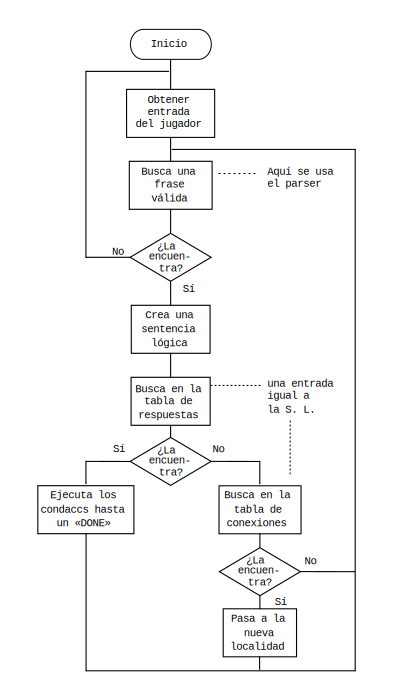

## Escribir una aventura

#### Enfoque previo

Es muy importante un buen planteamiento si se quieres crear una aventura con un nivel aceptable. De nada sirve sentarse frente a la máquina y empezar a teclear esperando la inspiración. Lo único que se conseguirá es un desorden de números y palabras, sin otro recurso que volver a empezar todo el trabajo de nuevo.

Para ilustrar el método recomendado, crearemos y desarrollaremos una simple aventura desde el inicio de la idea hasta el resultado final.

¡Recuerda salvar tu BD con regularidad!

#### El guion inicial

Esa idea inicial es siempre la parte más difícil al crear cualquier cosa. Una historia original puede dar al juego un interés mucho mayor que la vieja historia de rescatar a la consabida princesa. Guiones hay de todas clases y de todo tipo, pero aconsejamos que si intentas basar la historia en una película, libro o cómic, y luego intentas usarla comercialmente, te asegures antes de obtener el permiso del autor o de los actuales dueños del copyright.

En nuestro ejemplo tomaremos los problemas que pueden ocurrirle a un pasajero en su vuelta a casa:

Mientras estaba en la parada del autobús, el billete de subida fue arrebatado por un golpe de viento y luego cogido y llevado por un pajarito hasta un cercano parque.

El ordenador juega la parte del pasajero a quien se debe dirigir para encontrar el BILLETE antes de que llegue el autobús.

#### Diseño del juego

Ahora que la idea está más clara, es importante hacer un boceto del área de juego; en nuestro ejemplo sería algo parecido al [diagrama 2](#diagrama-2).

Es de notar que la zona de juego debe estar cerrada de una manera lógica, o el jugador no entenderá por qué no puede ir en una dirección si no hay nada que le impida el paso.

Para el ordenador, una aventura consiste en un determinado número de apartados o localidades que el jugador debe visitar; es ahora el momento de decidir qué zonas del boceto se tomarán como localidades y numerarlas individualmente.

Se debe intentar hacer una escala consistente o lógica \(a menos que el juego sea ilógico intencionadamente\), evitando que con un solo paso se vaya de una localidad a otra que aparentemente queda a varias millas de distancia.

La localidad 0 debe ser reservada siempre como pantalla de títulos y dejaremos libre también la 1 para darle un uso especial; por lo tanto comenzaremos desde la 2 hacia arriba. En nuestro ejemplo hemos escogido 7 localidades:

2\) parada del autobús

3\) en el jardín

4\) cerca del banco

5\) en el pabellón de música

6\) el estanque

7\) al lado del árbol

8\) arriba del árbol

Ahora podemos empezar las descripciones de las localidades. Deben ser lo más imaginativas posible, pero en estilo corto e interesante. Hay que procurar mantener una misma forma verbal todo el tiempo, generalmente en primera \(yo\) o segunda \(tú\) persona, o pronto el jugador tendrá una seria crisis de identidad. Sea cual sea la forma elegida, debe concordar con los Mensajes del sistema \(ver [más adelante](#check)\).

###### Diagrama 2


Por una mayor claridad y poder ver mejor los posibles movimientos, haremos un mapa del [lugar](#diagrama-3).

###### Diagrama 3


###### Pantalla de muestra del menú


### Empezando a teclear

#### Localidades

Selecciona la opción L en el menú principal. Un pequeño submenú te mostrará las opciones para Insertar o Corregir \(_amend_\) una localidad. Como todos los menús se parecen, examinaremos estas opciones para familiarizarnos con ellas. \(Ver el esquema de menú del dibujo anterior\).

Cualquier cosa que se teclee aparecerá en la parte inferior de la pantalla, como siempre. Las zonas en _inverse_ nos indican lo que hay que teclear para obtener las funciones que figuran a la derecha. Por ejemplo: La opción P nos dará una descripción de la localidad elegida (en este caso será la 0, que siempre existe para simplificar el trabajo interno del PAW) y podremos ver la inclusión de colores, etc., dentro del texto, para destacar ciertas palabras. Ese texto debe ser reemplazado por nuestra introducción, así que debe ser _corregido._

Con cualquier tecla volvemos al submenú y tecleando \[A 0\] \(no olvidar el espacio\) veremos el texto de la localidad elegida, pero con el cursor al final para una posible edición. Para limpiar TODO el texto teclea EDIT \(CAPS SHIFT + 1\) dos veces y obtendrás una localidad limpia para trabajar.

*Nota:* tener en cuenta que con teclear CAPS SHIFT + 6 \(flecha hacia abajo\), dos veces, lo que se obtiene es un _stop_ en _input,_ con mensaje de error en la parte inferior de la pantalla. Basta apretar cualquier tecla para volver al último menú usado, pero dejando el texto original intacto. Esta es la diferencia entre EDIT y el 6.

#### Colores

El texto que utilizaremos como pantalla de introducción va a incluir algunos colores para destacar el título. Ahora teclea once espacios para que quede centrado.

Tecleando EXTRA MODE \(que es SYMBOL SHIFT + CAPS SHIFT en el 48K\), los números del 0 al 7 darán el papel o color de fondo. Si queremos que el título tenga un fondo rojo, apretaremos el 2.

Teclea el título, que en nuestro caso es «EL BILLETE», y ahora debemos volver al color original de papel, así que teclea EXTRA y 0 para obtener el negro.

Necesitamos poner una línea en blanco entre el título y el texto, pero no podemos teclear ENTER porque esto termina la edición, por lo tanto, necesitamos un *código extendido de control de pantalla* \(CECP\); estos son códigos de 0 a 7 que tienen varios usos dentro de PAW. CECP 7 da automáticamente un _newline_ (CENTRO o nueva línea\). (check)

Para usar un CECP hay que hacer una pequeña _trampa_ con el editor de la siguiente forma: Primero teclea EXTRA y selecciona el color blanco \(7\), luego teclea DELETE \(borrar\) una sola vez; con ello borrarás el control del papel pero dejará el número 7, por lo tanto, como dijimos antes, el cursor saltará al principio de una nueva línea. Haz esto otra vez para dejar una línea en blanco y teclea el resto de la introducción. Ten en cuenta que PAW hace un formateo automático del texto.

TEXTO: \[Mientras esperaba el autobús una ráfaga de viento se llevó mi billete. ¿Puede Vd. ayudarme a encontrarlo?\].

Cuando hayas terminado, teclea ENTER para finalizar la edición y luego cualquier tecla para volver al submenú.

Con la opción P se puede ver el texto todavía sin formatear, pues esto solo se ejecuta mientras se juega el juego.

Con L se imprimirá el texto. Si parece que el ordenador se cuelga teclea BREAK \(CAPS SHIFT + ESPACIO en 48K\) para volver al menú, y entonces busca en la guía técnica más información sobre la impresora.

Con I se crea una nueva localidad. No hace falta teclear un número detrás porque PAW automáticamente le asigna el próximo que esté libre. De momento dejaremos la localidad 1 sin usar, así que solo teclea I + ENTER y ahora tendrás una localidad virgen para usar. Con ENTER y cualquier tecla volverás al submenú.

Ahora teclea I + ENTER otra vez para insertar la localidad 2 y luego poder teclear el texto que la describe.

Debido al formateo automático hay que teclear siempre los espacios aunque sea al final de la línea porque si no, el programa tomará dos palabras como si fuera una sola larga. Los espacios sobrantes serán suprimidos luego, durante el juego.

**REGLA:** Teclea siempre el espacio entre dos palabras o entre un punto final y el comienzo de la próxima frase, aunque ese espacio esté al comienzo de una nueva línea de pantalla. Luego será suprimido por el formateador si es necesario.

TEXTO LOCALIDAD 2: \[Estoy en la parada del autobús en una calle de dirección norte-sur. Al oeste queda un parque cuya verja de hierro está abierta\].

Vuelve al submenú con ENTER \(desde ahora omitiremos el uso de la palabra ENTER, suponiendo que con tu inteligencia habitual has captado la onda\). \[porque suponemos que lo recordarás y nos ahorra tener que mecanografiarlo con nuestros deditos.\]

Ahora es el momento de demostrar cómo PAW previene y avisa cuando una orden no es válida: teclea I + ENTER \(_juraíto_ que es la última vez que te lo recuerdo\) y como resultado tendrás una parpadeante interrogación después del 3. Esto se debe a que PAW se ha dado cuenta de que no se necesita ningún número después de la opción insertar.

Por otra parte PAW posicionará siempre el cursor tan cerca al problema como pueda, en este caso con un solo DELETE quitaremos el número \(no te preocupes por el espacio que queda pues PAW ignora cualquier espacio superfluo\).

Ahora ENTER proporciona la localidad 3 en blanco.

TEXTO LOCALIDAD 3: \[La hierba sobre la cual camino está muy bien cuidada. Hacia el norte hay un cómodo banco y hacia el este queda un estanque\].

TEXTO 4: \[Estoy en un camino de grava que va de este a oeste, muy cercano a un cómodo banco. Hacia el sur hay un cuidado césped y hacia el norte hay un pabellón de música\].

TEXTO 5: \[Estoy en el pabellón de música. Al sur hay un camino de grava\].

TEXTO 6: \[El sol crea bellos efectos de luz en la superficie del estanque, mecida por una suave brisa. Hay un camino al norte que termina en un lloroso sauce. Al este queda un cuidado césped\].

TEXTO 7: \[Estoy al lado de un sauce llorón. Al sur queda el estanque\].

TEXTO 8: \[Estoy sentado en una rama del sauce, con una visión panorámica del parque; lejos, al este, más allá de la verja del parque, puedo ver la parada del autobús\].

Usa P para chequear lo que has tecleado y cuando la pantalla se llene de texto aparecerá el mensaje «más...» en la parte inferior de la pantalla. Si entonces pulsas cualquier tecla \(excepto BREAK,ESPACIO o N\) aparecerá otra pantalla llena de texto y así hasta llegar al final donde aparece el mensaje «PULSE CUALQUIER TECLA».

BREAK, ESPACIO y N causarán un _BREAK error_ y te permiten salir del listado. Vale. Ahora tenemos varias localidades pero no hay modo de llegar de una a otra. Eso nos deja dos opciones por ver: la opción B, con la que se inicia una nueva página de memoria en los 128K. De momento no la toques, porque el juego de práctica cabe sobradamente en la página 0. Sobre la opción B, trataremos más extensamente en la Guía técnica.

Con la opción Z, como agudamente habrás deducido, volveremos al menú principal.

#### Conexiones

Desde el menú principal, tecleando C vamos a un menú similar al de las localidades. Date cuenta que las entradas pueden ser corregidas con A, presentadas en pantalla con P, o sacadas por impresora con L.

La razón de esto es que PAW ya ha insertado una línea en blanco en la tabla de conexiones cada vez que tú has puesto una nueva localidad. Si usas la opción P para mirar la tabla, verás que ya hay entradas en blanco para las localidades de 0 a 8.

Si miramos otra vez nuestro mapa veremos las conexiones que se requieren entre localidades. Desde la localidad 2 \(parada autobús\) necesitaremos solamente el movimiento OESTE que nos llevará a la localidad 4.

Por lo tanto, hay que teclear \[A 2\] para corregir la entrada de la localidad 2, y luego teclear \[OESTE 4\] lo que indica al PAW que, cuando el jugador teclee la palabra «OESTE» y esté en la localidad 2, debe ser movido a la localidad 4.

Si usamos ahora la opción P para examinar la entrada que acabamos de hacer \(date cuenta de que con \[P 2\] se imprimirán solamente las entradas a partir de la localidad 2 hacia arriba\), entonces encontrarás que la entrada esté más o menos:

```
Localidad 2 O to 4

etc.
```

Esto es porque PAW sabe que O es un sinónimo de OESTE \(un sinónimo es una palabra que significa lo mismo\). PAW usará siempre el sinónimo más corto.

Para la localidad 3, necesitamos 3 conexiones: NORTE \(a 4\), OESTE \(a 6\), NOROESTE \(a 7\). Las conexiones que quedan son las siguientes:

`Localidad 4 (N 5), (E 2), (S 3), (SO 6), (0 7)`

`Localidad 5 (S 4), (SO 7)`

`Localidad 6 (N 7), (NE 4), (E 3)`

`Localidad 7 (ARRIBA 8), (NE 5), (E 4), (SE 3), (S 6)`

`Localidad 8 (BAJAR 7)`

Ahora corrige las entradas de la localidad 0 para que cualquier movimiento nos lleve a la localidad 2, donde comenzamos el juego \(hay una forma mejor de hacer esto, pero necesitamos para ello usar una tabla que todavía desconocemos, y que ya te mostraremos más adelante\).

Ahora solamente falta teclear \[A 0\] ENTER \[N 2\] ENTER, y ya nos indica que de la localidad 0 al NORTE iremos a la 2.

Comprueba todas estas entradas mirando el mapa hasta asegurarte de que todo sea correcto.

Recordamos que usando la Z se puede volver al menú principal y que desde el menú principal con la opción S se puede grabar en cinta la base de datos actual.

También puedes, con la opción E, examinar el resto del menú que no cabe en la pantalla.

### Jugar al juego

Ha llegado el momento de intentar probar nuestro juego. La opción requerida para ello es T en el menú principal. Te preguntará si quieres un diagnóstico o no, por el momento solo tecleemos N y ENTER, porque no sabemos todavía para qué sirven los diagnósticos.

Ahora debe de aparecer la pantalla con el título que tecleamos al comienzo. La línea de _input_ se usa para poner las órdenes para que el PAW las interprete y ejecute tus acciones de acuerdo con la información que le hayas dado cuando escribiste el juego.

De momento, solamente le hemos dicho hacia donde nos puede llevar cuando se teclea una dirección. Eso es lo que intentaremos probar. Ahora empecemos el juego correctamente tecleando NORTE desde la localidad 0 y, por supuesto, ENTER.

Recordemos que con DELETE podemos corregir cualquier error que hayamos cometido en la línea de _input._

Veremos entonces que la pantalla se limpia y que la descripción para la localidad 2 aparece. Si ello no ocurre, probablemente la entrada en las conexiones es errónea. No te preocupes, porque se puede volver otra vez al editor tecleando ABANDONAR o RETIRAR \(que es el comando que el PAW conoce desde el principio\) y respondiendo S a la pregunta que el PAW hace y contestando N a la siguiente pregunta de que si «Quieres probar otra vez» el juego o no.

Vuelve a las conexiones y corrige lo necesario.

Ahora hay que probar moverse entre las localidades viendo todos los movimientos posibles \(toma nota de cualquier movimiento erróneo para poderlo corregir cuando vuelvas al editor\).

También es tiempo de hablar de algunas órdenes que PAW ya tiene definidas y que conoce. Por ejemplo, tecleando M o MIRAR se repite otra vez la descripción de la localidad, lo que es muy útil para el jugador si hay un montón de texto en una descripción que ya ha hecho _scroll._ Tecleando I o INVENTARIO harás una lista de los objetos que lleves en este momento, por ahora llevarás solamente un objeto desde el comienzo, pero no podrás hacer nada con él.

Por cierto, en este momento cabe destacar que, puesto que PAW acepta hasta 120 palabras en la misma entrada, se puede hacer un recorrido por todo el juego tecleando todas las direcciones de una vez. Incluso durante el recorrido, puedes hacer un inventario.

### Objetos

Un objeto es cualquier cosa que el jugador puede manipular dentro del juego, por ejemplo: una manzana que puede comer, una llave que puede usar para abrir una puerta, una espada para pelear, etc.

En nuestro juego, que es bastante simple, usaremos los siguientes objetos \(no todos ellos tendrán una función en el juego finalizado\):

```
Objeto 0     una antorcha encendida.

Objeto 1     una bolsa.

Objeto 2     un emparedado.

Objeto 3     una manzana.

Objeto 4     un billete de autobús.

Objeto 5     una piedra.

Objeto 6     un anorak.

Objeto 7     una antorcha apagada.
```

**Muy importante:** La antorcha se trata como dos objetos separados. Cambiaremos del uno al otro cuando el jugador la apague o la encienda.

Otro punto a destacar es el hecho de que PAW, al hacer un inventario, muestra la descripción de los objetos eliminando la primera palabra \(«una» en este caso\). Para evitar esto, se deberá insertar al comienzo de cada descripción un código de cambio de color, por ejemplo \[EXTRA 0\] para poner el paper negro. Este truco evita que PAW se coma la primera palabra.

La opción O del menú principal sirve, como muy agudamente habrás deducido, para poner las descripciones de los objetos, de una forma muy similar a como hemos puesto las descripciones de las localidades.

Veremos que también existe un objeto 0 si se usa la opción P, para hacer una lista de ellos. Por lo tanto, hay que corregir esta entrada del objeto 0 tecleando \[A 0\] y usando un color de tinta diferente. Por ejemplo, si queremos usar el color cian, hay que pasar al modo extendido o _extra_ en el 128 y luego teclear al mismo tiempo CAPS SHIFT + 5.

No te olvides de volver al color blanco otra vez, esto se logra con el modo extendido y luego CAPS SHIFT y 7 al mismo tiempo. Esto debe hacerse al final de cada texto.

Volvamos al menú principal para que le podamos decir a PAW más cosas sobre nuestros objetos. Con la opción I tenemos dónde está cada objeto inicialmente, es decir, cuando la aventura comienza.

Vemos que no hay opción de insertar, puesto que eso ya queda hecho automáticamente por PAW cuando en la tabla 0 se ha puesto un objeto. Date cuenta que corregir \(_amend_\) \(A\) tiene dos parámetros; el número del objeto y su posición.

Esta posición tiene varios valores especiales que son muy importantes \(son localidades que no existen\):

```
252     es para objetos no creados, por ejemplo, todavía no existen dentro del juego.

253     tiene todos los objetos llevados encima (puestos) por el jugador.

254     tiene todos los objetos llevados por el jugador, pero no puestos encima.
```

Por ejemplo, si queremos hacer de la antorcha encendida un objeto no creado, hay que teclear \[A 0 252\], y como antes estaba como objeto llevado, el mensaje «AMEND» (que significa corregido) será impreso para mostrar que PAW ha hecho la corrección.

Tecleemos ahora las siguientes posiciones iniciales, pero sin poner los comentarios que van después del punto y coma \(;\).

Luego, cuando hayas terminado, usa la opción P para corregirlos.

```
Objeto 1     2;       porque la bolsa se encuentra en la parada del autobús.

Objeto 2     254;     porque el jugador lleva el emparedado.

Objeto 3     254;     y la manzana.

Objeto 4     8;       significa que el billete está encima del árbol.

Objeto 5     3;       una piedra que está en la hierba.

Objeto 6     253;     porque el jugador lleva puesto encima el anorak.

Objeto 7     254;     y lleva consigo la antorcha apagada.
```

Ahora vamos a decirle a PAW más cosas acerca de los objetos; por ejemplo, su peso relativo, o si son capaces de contener otros objetos, o si el jugador puede llevarlos puestos encima. Volvemos al menú principal y tecleamos la opción X, con ello pasamos al menú de peso de objetos, que también nos permite poner los otros dos atributos \(_contenedor_ y _ponible_\). Como siempre, PAW ya ha creado una entrada en esta tabla para todos los objetos que se han insertado previamente. De hecho ya le ha dado a cada objeto el peso de una unidad, no contenedor, y no ponible. Esto lo asigna a cada objeto por defecto \(por defecto significa el que PAW le da ese valor, si tú no le das ninguno\).

Necesitamos probablemente corregir el anorak y la bolsa, puesto que el jugador es capaz de llevar puesto encima el anorak \(de hecho el jugador está haciendo esto desde el principio cuando comienza el juego\) y la bolsa debe ser capaz de contener otros objetos. Además, el anorak y la bolsa son mucho más pesados \(relativamente\) que los otros objetos y hay que cambiarles su valor a 3 unidades cada uno.

Cuando se teclea A para corregir aparecen 3 valores; uno es el número del objeto, otro es su peso unitario, y finalmente, el tercero son los otros atributos, que pueden ser:

```
0 =     ninguno.

1 =     contenedor para otros objetos.

2 =     el jugador puede ponérselo y quitárselo.

3 =     un contenedor que puede ser puesto y quitado (ejemplo: unos pantalones que tienen un bolsillo).
```

Volvamos a nuestra bolsa, \(objeto 1\) que es un contenedor y pesa 3 unidades. Entonces necesitamos teclear \[A 1 3 1\] \(**No te olvides de poner los espacios**\).

El anorak no tiene bolsillos \(por lo menos en este juego no los tiene\), pero se puede llevar puesto y se puede quitar, por lo tanto hay que teclear \[A 6 3 2\].

Usemos la opción P para examinar las entradas que hemos hecho. Deben ser:

```
Objeto 0     Pesa 1

Objeto 1     Pesa 3         C ;         C significa que es un contenedor. (1)

Objeto 2     Pesa 1

Objeto 3     Pesa 1

Objeto 4     Pesa 1

Objeto 5     Pesa 1

Objeto 6     Pesa 1         WR ;      WR significa que se puede poner y quitar. (2)

Objeto 7     Pesa 1
```

Ahora podemos probar la aventura otra vez para asegurarnos de que todos los objetos estén donde tienen que estar. Pero todavía no se puede hacer nada con ellos, necesitamos decirle a PAW qué palabra describe cada objeto.

También es el momento de hacer un _save_ (salvado) de la base de datos, pero teniendo el cuidado de que sea en una nueva sección de la cinta y usando un diferente número de versión.

#### Vocabulario

Tiene un menú más complejo que los que hemos visto hasta ahora, pero la mayoría de las entradas son solo recordatorios de las opciones a tu disposición.

El vocabulario es una lista de las palabras que PAW puede reconocer si el jugador las teclea durante el juego. Por lo tanto, cualquier palabra que no esté en esta tabla no tendrá ningún efecto. Hemos dejado un vocabulario inicial que ya contiene los verbos, nombres, etc., más usados en las aventuras.

La entrada para una palabra consiste en un máximo de cinco letras que, o bien son la palabra completa (por ejemplo NORTE) o sus cinco primeras letras (por ejemplo DESCR para la palabra «describir»), seguido de su valor y de su tipo \(por ejemplo: Nombre, verbo, etc.\).

El usar solamente cinco letras para definir una palabra reduce la cantidad de memoria que se requiere para guardar el vocabulario entero; también reduce la longitud de las repuestas \(entradas o _inputs_\) del jugador, y acelera la búsqueda de palabras por el propio PAW. Además, cinco letras son suficientes para establecer una diferencia entre la mayoría de las palabras de uso común.

El menú permite la **inserción** y el **borrado** \(_delete_\) de palabras; el **listado** de entradas hechas para cada tipo de palabras, y la inspección de sinónimos.

Si tecleamos \[S OESTE\] veremos que PAW muestra el sinónimo «O» también. Si tecleamos \[P 2\] tendremos una lista de todos los nombres que hay actualmente en PAW \(los números que corresponden a cada tipo de palabra se muestran al lado derecho del menú\). También encontrarás que PAW tiene ya en su vocabulario todas las direcciones de los puntos cardinales, además de otras útiles.

Necesitamos ahora aumentar el número de **nombres** añadiendo las palabras que representan nuestros objetos.

Todos los nombres con un valor menor de 50 son nombres propios, por ejemplo: nombres de personajes o lugares, pero más específicamente, para PAW son nombres que no se pueden cambiar por los pronombres enclíticos «-lo» o «-la».

Explicándolo mejor: para una mayor rapidez, PAW detecta qué palabras son nombres propios \(cuyo valor es menor de 50\) y cuáles pertenecen a sustantivos \(cuyos valores sean mayores o iguales a 50\).

En la frase «Coge el martillo, golpea a Manolo en la cabeza y déjalo», si has dado a «Manolo» un valor menor de 50 y a «martillo» uno mayor o igual a 50, PAW entiende que el pronombre enclítico «-lo» del últmimo verbo, se refiere al martillo. Otro ejemplo: en la frase «Dale a Carlos una tortilla y quítasela», entenderá que el pronombre «-la» de «quitársela» se refiere a la tortilla.

Tanto «lo» como «la» también pueden ponerse antes del verbo con iguales resultados.

Otro hecho importante es que las palabras con valor inferior a 20, son nombres que, si PAW no encuentra un verbo en la frase, los convertirá temporalmente en verbos.

Por ejemplo: la palabra NORTE es un nombre y puede ser usado en la frase «Ir al norte», pero también puede ser tecleada sola, en cuyo caso, como tiene un valor inferior a 20, se comportará como un verbo \(o sea, que te vas al norte\).

Finalmente, las palabras con un valor menor de 14 se tomarán siempre como palabras-movimiento \(cualquier palabra que sea una dirección\) y sirven para determinar el mensaje que PAW imprimirá si no puede hacer nada con esa frase \(por ejemplo, determinará si te responde con un «No puedo» o con un «No puedo ir en esa dirección».

Hay que notar que este concepto de «las palabras cuyo valor es menor a 14 es un palabra-movimiento» se aplica tanto a verbos como a nombres interpretados como verbo.

Puesto que todos nuestros sustantivos de _objetos manejables,_ les daremos un valor mayor de 49.

```
ANTORcha         50

BOLSA            51

EMPARedado       52

MANZAna          53

BILLEte          54

PIEDRa           55

ANORAk           56
```

Usa la opción I para insertar estas 7 palabras como nombres \(tipo 2\). Por ejemplo, teclea \[I ANTOR 50 2\], etc.

Con \[P 2\] se puede comprobar que estos nombres están ahora en el Vocabulario.

También necesitaremos usar adjetivos para diferenciar entre las dos antorchas. Con \[P 3\] podemos ver los adjetivo que PAW ya conoce.

Si las palabras «encendida» y «apagada» no están ya en la lista, insértalas procurando darles un número alto, pues son poco usadas, y así PAW no tendrá que pasar a través de ellos cada vez que busque una palabra más común como por ejemplo un nombre o un verbo.

Todos los números desde el 2 al 254 están disponibles para cualquier tipo de palabra sin limitación en la cantidad de sinónimos usados.

Si tratas de insertar una palabra que ya está presente, PAW te avisará, lo mismo que si tratas de borrar una que no esté presente.

Ten en cuenta que PAW solo tomará las primeras 5 letras, cuando te refieras a una palabra, e ignorará el resto.

Luego volveremos al vocabulario, pero ahora vamos a decirle a PAW qué palabras definen nuestros objetos. Porque hasta ahora hemos descrito cada objeto, cuánto pesa, y en qué lugar comienza, pero no le hemos dicho qué palabra lo identifica.

Vuelve al menú principal y así podremos continuar con otra opción.

#### Palabras para los objetos

La opción W es una tabla donde las palabras que están en el vocabulario se asocian con un objeto particular. En esta tabla solamente se puede corregir, imprimir en pantalla, o imprimir en impresora, puesto que PAW ya ha insertado una entrada en blanco para cada objeto, cuando se hizo su descripción en la tabla de texto para objetos. Así pues, tecleando P aparecerán 8 entradas en blanco para nuestros objetos.

La tabla de asociación de palabras y objetos permite poner un nombre y un adjetivo, asociados al número del objeto. En nuestra aventura, nuestros objetos requerirán las siguientes entradas:

```
Objeto     0     ANTORCHA ENCENDIDA

Objeto     1     BOLSA _

Objeto     2     EMPAREDADO _

Objeto     3     MANZANA _

Objeto     4     BILLETE DE AUTOBÚS _

Objeto     5     PIEDRA _

Objeto     6     ANORAK _

Objeto     7     ANTORCHA APAGADA
```

Este signo especial «\_» significa que _no hay palabras,_ o sea que entenderá cualquiera. Siempre hay que teclear \_ \(este signo\) si no hay un adjetivo que describe al nombre.

Suponemos que con tu sagacidad habitual habrás notado que no se puede insertar un objeto, sino solamente corregirlo \(A\).

#### Diagnóstico

Con la T en el menú principal se selecciona la opción de probar el juego, o sea, hacer un test de la aventura.

Primero PAW te pregunta si quieres diagnóstico o no. Si tecleas «sí», aparecerá el título y la introducción, y en la parte de abajo se pide un entrada (_input_) al jugador.

Que hayas contestado que sí quieres diagnóstico, no tiene efecto aparente todavía, pero si tecleas ENTER antes de cualquier otra cosa, el cursor desaparecerá y aparecerá una línea parecida a:

```
Flag 38 = 0 ?
```

con _flag_, PAW se refiere a una **bandera**, en este caso la 38, la que lleva el número de localidad presente.

PAW contiene 256 de estas banderas, y en cada una se puede situar un número de 0 a 255. Se usan para indicar el estado en parte del juego.

Por ejemplo, si decides que la bandera 11 se ponga en 1 cuando la puerta del parque esté cerrada, y haga un _clear_ a 0 cuando esté abierta, esto servirá de marcador para que luego puedas dejar pasar o no al jugador cuando teclee ENTER. Es decir, si la bandera estuviera a 0 podría pasar, y si la bandera estuviera a 1, le informarías de que la puerta está cerrada.

PAW tiene para su uso específico, varias banderas \(de la 0 a la 10 y de la 29 a la 59\). Por eso, si el valor que aparece al lado de la bandera 38 es igual a 0, PAW sabe que tu localidad actual es 0 en este caso. Para ver cómo funciona esto, teclea ENTER de nuevo \(con ENTER cambiamos el uso entre la opción diagnóstico o continuar con la entrada de texto en el juego, si no has tecleado ningún otro comando\) y vámonos hacia el principio del juego usando la palabra NORTE o cualquier otra dirección que hayas puesto. De nuevo, antes de cualquier otra cosa teclea ENTER y verás que la bandera ha cambiado a 2, esto es, por supuesto, porque estás en la localidad 2.

```
Flag 38 = 2 ?
```

Puedes ver los valores de cualquier otra bandera tecleando su número antes de apretar ENTER, por ejemplo: \[100 ENTER\] y entonces puedes ver el valor de la bandera 100.

```
Flag 100 = 0 ?
```

Pero hay otra opción mucho más potente que te deja poner el valor que quieres que tenga una bandera. Ello se hace poniendo el signo = frente al número. Por ejemplo, si en este momento tecleas \[= 10 ENTER\], verás que la bandera 100 se ha hecho igual a 10.

```
Flag 100 = 10 ?
```

La bandera 100 no hace nada en este juego y su valor no es importante, pero si te pones a practicar por tu cuenta ten cuidado de **no** cambiar los valores de ninguna otra bandera de momento, porque te puedes tropezar con alguna otra bandera que sí sea importante, y el juego se te haga un enredo. Vuelve a la línea de _input_ pulsando ENTER y veamos que más puede hacer PAW.

Ahora sí que seremos capaces de manipular los objetos en el juego. De momento la bolsa estará en la parada del autobús. Con nosotros llevaremos el emparedado, la manzana, una antorcha apagada, y el anorak puesto.

Usa el diagnóstico para ver el valor de la bandera 1 \(se hace con \[ENTER 1 ENTER\]\), y vemos que tiene el valor de 3, que es el número de objetos que se llevan en las manos, pero no puestos encima. Volvamos a la línea de entrada de texto y tecleemos «coger saco» y PAW imprimirá el mensaje «Ahora cojo el saco». Es lo que se llama _auto-reporting_ \(o _informe automático_ de cualquier acción que hayas hecho\).

Esta última orden ha hecho que la posición del saco haya cambiado de la localidad 2 \(que era la parada del autobús\) a la localidad 254 \(que es una localidad especial para los objetos que puedan ser llevados pero no puestos\).

Fíjate que no hay ningún cambio en la tabla donde se localizan los objetos al comienzo, si no que lo que ha cambiado es la copia que se ha hecho de la base de datos cuando se empieza el juego. Si ahora miras el valor de la bandera 1 \(fíjate también que al volver a seleccionar diagnóstico, se muestra la última bandera que hayas mirado\) verás que su valor ha aumentado a 4.

Ahora prueba «quitar anorak» y recibirás el mensaje «No puedo quitarme el anorak, mis manos están llenas». Esto es porque PAW inicialmente \(si tú no has dicho lo contrario\) solo permite al jugador llevar 4 objetos al mismo tiempo, y en algunos casos esta limitación puede impedirle al jugador quitarse un vestido, etc., \(de hecho, quitarse una prenda es cambiar la posición de ese objeto de la localidad 253 \(llevado puesto\), a la localidad 254 que es llevado en la mano\).

Si, por ejemplo, dejamos el saco primero y tecleamos «quitar anorak» veremos que esta acción sí se puede hacer. Si miras otra vez a la bandera 1 te darás cuenta de que todavía tiene el número 4, esto es porque al quitarte el anorak has aumentado el número de objetos que llevabas en tus manos.

Ahora, como prueba, teclea las siguientes órdenes y fíjate qué hace cada una \(usando las banderas\):

```
Coger bolsa

Quitar anorak

Poner anorak

Coger manzana

Coger billete de autobús
```

Hay que darse cuenta de que todas las respuestas, excepto la de la última orden, mencionan los objetos por su nombre, esto es porque estaban todos a la vista y por lo tanto el jugador sabía que existían \(estaban en su misma localidad\). Pero para un jugador que no conociera el juego, el billete todavía _no existiría,_ y si al teclear «coger billete» ya en la respuesta lo mencionamos por su nombre, le estamos dando una pista muy importante. Y es que el PAW es muy cuco.

Si tratas de poner cualquier cosa dentro del saco descubrirás que lo que hace PAW es dejar caer los objetos al suelo. Esto es porque no le hemos dicho todavía **qué cosas** se pueden poner dentro de la bolsa. De momento solamente le hemos dicho que es un **contenedor.** En el próximo capítulo trataremos este tema.

Finalmente encentraremos un terrible «error» en nuestro juego: si tecleamos «coger la puerta», se nos dará la respuesta de «No hay ninguna de esas aquí» o «No está eso aquí», cosa que no debería porque en la descripción hemos dicho que hay una puerta.

Este es un problema muy frecuente, y ocurre porque hemos dicho a PAW que hay una manzana, un emparedado, etc., pero no que existe una puerta, y si usas coger o dejar, etc, con cualquier palabra que no esté en el vocabulario entonces PAW asume que es un objeto que _no está aquí._ Sin embargo, una vez que esa palabra enté en el vocabulario, PAW sabrá que no es un objeto \(siempre que no haya una entrada para esa palabra en la tabla de asociación de palabras y objetos\) y dará la respuesta «no puedo hacer eso» que es la correcta.

Así que volvamos al menú principal tecleando \[FIN, ENTER, SÍ, ENTER, NO, ENTER\] y seleccionaremos de nuevo la opción de vocabulario V.

Pongamos todos los nombres de las cosas que hayamos usado en la descripción, aunque no sean objetos, tales como:

```
Puerta     57

Reja       58

Hierba     59

Camino     60

Banco      61

Estanque   62

Árbol      63

Rama       63

Hoja       63
```

Es importante que «árbol», «rama» y «hoja» reciban el mismo número, porque no intentamos que sean manipulables, solamente que las entienda el _parser._ Si fueran manipulables, tendríamos que darles números diferentes. Esto es una consideración importante de diseño.

Ahora puede ser el momento de hacer otro test del juego para ver que la orden «coger puerta» produzca una respuesta correcta.

De momento hemos creado las localidades, las hemos conectado entre sí, hemos creado y descrito los objetos, les hemos asignado una palabra desde el vocabulario, un punto de comienzo en el juego, un peso relativo, si eran ponibles y si eran contenedores. El próximo capitulo tratará de cómo se crean algunos problemas y otros personajes para hacer que el juego sea más interesante.

### Procesos y respuestas

Hemos llegado a la sección que nos permitirá crear problemas y personajes en el juego.

#### La tabla de respuestas \(R\)

La **tabla de respuestas** \(R\) del menú principal es una forma especial de **tabla de procesos.** Una tabla de procesos puede verse como un lenguaje de programación secuencial \(se ejecuta, por orden, un comando en cada turno\). Las órdenes que se llevan a cabo se llaman «CondAccs» \(o también «CondActos» del inglés _CondActs._ N. del E.\) porque se pueden dividir principalmente en dos grupos: **cond**iciones y **acc**iones.

Antes mencionamos que el _parser_ de PAW divide las sentencias en frases, las cuales son organizadas entonces en lo que se conoce como **SL** \(sentencias lógicas\). En el caso de direcciones como NORTE \(que es una sentencia lógica por sí sola\), PAW usa la tabla de conexiones para descubrir hacia dónde se ha de mover el jugador. **Antes,** sin embargo, PAW mira en la tabla de respuestas para ver si hay alguna entrada en ella que pueda asociarse con la SL.

Es muy importante que quede claro el concepto de que cada frase que el jugador teclee y PAW entienda, debe tener su correspondiente entrada en la tabla de respuestas \(exceptuando la mayoría de los movimientos, que ya han sido puestos en la tabla de conexiones\).

La parte más importante de una SL es el verbo, que muestra el próposito de la frase; la siguiente en importancia, es el primer sustantivo, que muestra el objeto de la SL, por ejemplo en «coger manzana», _coger_ es el propósito y _manzana_ es el objeto que recibe la acción.

Si ahora seleccionamos R del menú principal aparecerá el submenú de esa tabla. Tecleando P para mirar la tabla e ignorando de momento cualquier otra entrada, vamos a considerar la entrada que pone:

I \_ INVEN

Las dos palabras \(porque \_ es _una palabra_\), indican el verbo y el sustantivo, respectivamente. Ahora «I» es un nombre _convertible_ en verbo \(como vimos en la [sección de vocabulario](#Vocabulario)\) esto significa que si se teclea por sí solo, es decir, si «I» es la única palabra que ha tecleado el jugador en la frase, será tomada como un verbo en la SL. La línea \( \_ \) indica que el nombre no es importante en esta entrada \(vendría a ser como la «no palabra» que vimos en la [tabla de objetos y palabras](#Palabras-para-los-objetos)\).

Lo que esto significa es que si el jugador solo teclea «I», PAW lo equiparará con la primera entrada de la tabla de respuestas que tenga la «I», y ejecutará la orden que se describa al lado de ella.

Para ejecutar una sentencia, PAW tiene que ejecutar cada uno de los _condacc_ \(órdenes\) en una lista que ya tiene. Ahora viendo en nuestro ejemplo la palabra «I», solamente tiene un _condacc._

**INVEN:** es una acción \(¡la parte activa de un _condacc_!\). Y es la parte activa porque, esta en concreto, se encarga de hacer una lista en la pantalla de los objetos que el jugador lleve consigo, puestos o no. No te preocupes de momento por cómo hacer esto, solo nos interesa saber que lo hace.

Cuando tecleaste «I» \(o «inventario» si lo has puesto como sinónimo\) durante la prueba del juego, fue esta, la entrada en la tabla de respuestas que causó que pasase algo: el _parser_ creó una sentencia lógica de «I \_», que entonces PAW emparejó con la primera entrada en la tabla de respuestas.

INVEN, después de hacer una lista de todos los objetos que lleva el personaje, le dice automáticamente a PAW que ya ha _acabado,_ y cuando PAW lo descubre, pide al _parser_ una nueva sentencia lógica, el _parser_ se la ofrece, decodificando las siguientes frases desde el _input_ del jugador. PAW entonces coge esta nueva SL y la compara con todas las entradas que hay en la tabla de respuestas, y así sucesivamente.

###### Diagrama 4



Este bucle \(_loop_ en inglés\) se muestra en el diagrama 4 en forma de diagrama de flujo que se puede seguir desde el cuadrado marcado como «Inicio». El bucle es bastante más complejo que lo que el diagrama te pueda parecer y de hecho se da una versión más completa en la guía técnica, pero de momento nos servirá.

Te aconsejamos fervientemente que vuelvas a leer los párrafos anteriores y estudies el diagrama, hasta que entiendas cómo PAW trabaja sobre una sentencia lógica antes de continuar.

Vamos a considerar la segunda entrada de respuestas:

`Hacer I    INVEN`

Como habrás deducido hábilmente, esta entrada toma en cuenta otra forma de la cual el jugador puede pedir una lista de objetos. Veamos ahora la entrada que pone QUIT \_ \(para hacer esto basta con apretar cualquier tecla excepto BREAK, ESPACIO o N\):

```
FIN _     QUIT
          TURNS
          END
```

Bien, FIN es un verbo del vocabulario, así que como la mínima frase que PAW considerará válida es un verbo, si FIN se teclea solo entonces ya el PARSER generará una SL de «FIN \_». En su búsqueda a través de la tabla de respuestas, PAW encontrará la entrada que hemos visto más arriba y empezará a ejecutar los _condacc._

QUIT es una condición \(la parte condicionante de la palabra _condacc_\). Una condición solo decide si PAW continúa para llevar a cabo el siguiente _condacto_ de la lista, es decir, no toma de por sí ninguna acción, sino una decisión.

**QUIT** lo que hace es determinar si el siguiente _condacto_ puede ser ejecutado, preguntándo al jugador «¿Estás seguro?». En caso de que conteste «NO», entonces QUIT avisa a PAW que ha hecho «algo» y este irá en busca de otra SL \(dejando en paz a QUIT\).

Esta es una forma un poco diferente de tratar las condiciones en PAW, pero QUIT es una condición bastante especial, cono verás en el futuro. Si el jugador teclea «SÍ» entonces QUIT no hace nada, y deja que PAW busque el siguiente _condacc_ de la secuencia, que entonces será TURNS.

**TURNS** es una acción que imprime «Has hecho x movidmientos o has dado x órdenes» en la pantalla. Donde x es el número de frases que el jugador ha tecleado desde el principio del juego. Aparte de este hecho, como tú no le has dicho a PAW que deje de buscar _condaccs,_ entonces éste continuará buscando END.

**END** es una acción también especial que imprime «¿Te apetece otro juego?, o ¿quieres jugar otra partida?» en la pantalla. Si el jugador teclea «SÍ» entonces END reiniciará el juego con todos los objetos en sus posiciones iniciales, etc. Si el jugador dice «NO» entonces generará un error «OK», lo cual te hará volver al menú editor de PAW. Si el menú editor de PAW no está presente \(por ejemplo, en un juego ya terminado\), entonces el computador hace un reset.

**MUY IMPORTANTE:** Debes tener siempre una acción END en alguna parte del juego, porque si no, no podrás volver a la sección editora tan fácilmente cuando lo estés probando. Tendrás que hacer uso de la tecla BREAK, la cual solamente funciona mientras que PAW está procesando, y como no es fácil pillarlo haciéndolo, porque es muy rápido, te será muy difícil.

Las otras entradas que ya están presentes en la base de datos, se hacen cargo de varios comandos estandarizados que los jugadores normalmente necesitarán en la aventura.

Los _condaccs_ usados en las otras entradas se discuten más abajo.

Te estarás preguntando por qué estas entradas están en una tabla y no forman ya de por sí parte de PAW, si son tan necesarias en cada juego. Pues bien mi querido saltamontes, la razón es que, aparte del hecho de que es mucho más fácil ponerlas en una tabla que en el propio juego, **puede que tu juego no las necesite,** y de esta forma las puedes borrar cuando quieras.

**DESC** es una acción. De hecho, es la que se usa en la entrada «M \_» de la tabla. Y esta acción hace que PAW abandone la búsqueda por la tabla de respuestas y reDESCriba la localidad actual del jugador. También tiene varios sinónimos: mirar, describir, etc., en el vocabulario.

**SAVE** y **LOAD** son dos acciones que permiten guardar \(_save_\) y recuperar  \(cargar o_load_\) el estado actual del juego en cinta. La posición actual del juego incluye también cualquier otra pieza de información que se necesite para restaurar exactamente el juego en el mismo estado en el que estaba, ello incluye los valores de las banderas, las posiciones de los objetos, y mucha más información. No debes confundir aquí los anglicismos _save_ y _load_ que hemos dejado en el vocabulario, con las **acciones** SAVE y LOAD. Nosotros hemos incluido también otros sinónimos, como «GRABAR» y «CARGAR», en el vocabulario, pero todos ellos usarán también las acciones SAVE y LOAD en la tabla de respuestas.

Es de notar que ambos SAVE y LOAD ya de por sí hacen una acción DESC cuando han terminado. Lo que significa que cualquier _condacc_ u orden del _input_ del jugador, que siga, será ignorada.

**RAMSAVE** Y **RAMLOAD** son dos acciones similares a SAVE y LOAD, excepto en que usan un «buffer» \(un área de memoria libre\) para guardar la posición del juego. Esto significa que no tienes que andar toqueteando cintas.

Solamente se puede guardar una posición, y como lo hace en la memoria, suponemos que sabes que si apagas el ordenador desaparecerá. Aunque de todos modos, esto debes hacérselo ver claramente al jugador en las instrucciones. También el área del _buffer_ se pierde cuando vuelves al editor, porque puedes querer cambiar algo en el diseño del juego entre dos pruebas. El número que sigue a RAMLOAD es un parámetro, y le dice al _condacc_ cuántas de las banderas debe restaurar de un RAMSAVE previo. Esto permite que la puntuación y otras cosas se mantengan, aunque el jugador _haga trampas_ en una parte muy difícil del juego usando constantemente RAMSAVE y RAMLOAD.

A ambas acciones les sigue una acción DESC, puesto que a diferencia de SAVE y LOAD, continuarían hasta el siguiente _condacc._

Si a PAW se le acaban los condaccs en una lista sin haberle aclarado que ya ha hecho \(DONE\) algo, sencillamente «caerá» hasta el final, y al darse cuenta de esto, continuará en su búsqueda de otro SL. También dijimos que QUIT era una condición bastante especial. Para comenzar, es la única condición que busca información del jugador, y por otra parte, también le informa a PAW de que «se ha hecho algo» si el jugador teclea «NO» \(es decir, que no quiere abandonar el juego\), lo cual hace que PAW comience a buscar otro nuevo SL.

**MUY IMPORTANTE:** Si una condición normal «falla», sencillamente hará que PAW continúe buscando en la tabla de respuestas otra condición que coincida con la SL.

El resto de _condactos_ usados, se considerarán ahora en relación con las entradas de las que forman parte. Para simplificar nuestra explicación, debemos considerar la posición de un objeto en el juego. Puede estar en cuatro lugares:

HERE \(AQUÍ\): es la localidad actual del jugador \(es el valor que se guardaba en la bandera 38, si recuerdas bien\). Tiene un valor de 255.

CARRIED \(LLEVADO CONSIGO\): Localidad 254, que es una localidad imaginaria donde se ponen todos los objetos que el jugador lleve.

WORN \(PUESTOS ENCIMA\): Localidad 253, que es una localidad imaginaria donde se guardan todos los objetos que el jugador lleve puestos.

NOTHERE \(AUSENTES\): ¡En cualquier otro sitio! Esto también incluirá la localidad 252, que es una localidad imaginaria donde se guardan todos los objetos que aún no existen.

Resumiendo:

```
Aquí =            Localidad 255
Llevados =        Localidad 254
Puestos =         Localidad 253
Ausentes =        Localidad 252 = No creado todavía.
```

Vamos a ver otras dos entradas en la tabla de respuestas:

```
COGE TODO   DOALL 255 (Parámetro: Localidad donde estás: AQUÍ)

COGER _     AUTOG
            DONE
```

Estas dos entradas son las que permiten al jugador coger cualquier objeto. Coger un objeto significa cambiar su localidad desde AQUÍ \(255\) a LLEVADO \(254\).

Ignoremos por ahora la entrada «Coge todo» y vamos a estudiar cómo funciona "COGER \_". Como dijimos antes, ese subrayado significa «cualquier palabra», así que no importa qué nombre teclee el jugador en una frase que contenga el verbo «COGER». La entrada COGER \_ siempre _casará_ \(esto es lo que se llama «activar» o «preparar» una entrada\).

Veamos la frase «Coger la manzana». El artículo _la_ será ignorado por PAW porque no está en el vocabulario, por lo que la SL será «Coger manzana», y esto _activará_ la entrada "GET \_" cuando PAW encuentre este _condacto._

**AUTOG** es una acción que AUTOmáticamente coGerá cualquier objeto que haya sido especificado por el nombre. Es donde se aplica la tabla de asociación de palabras y objetos. AUTOG mira a través de esa tabla buscando una entrada que sea similar al nombre de la SL. Si la encuentra \(«manzana» en nuestro ejemplo\) entonces sabe el número del objeto al cual se refiere \(que en el caso de la manzana es 3\). Se asegura entonces de que la localidad actual de ese objeto sea AQUÍ \(255\) y la pasa a LLEVADA \(que es 254\) y entonces imprime el mensaje «Ahora tengo el objeto \_.» donde la línea de subrayado se reemplaza por la descripción del objeto actual, por ejemplo el que acaba de marcar el AUTOG.

Si no se encuentra ninguna entrada, entonces hay cinco posibilidades.

1. El jugador ha intentado coger un objeto que ya lleva o tiene puesto. En cuyo caso se imprime el mensaje «Ya tengo el \_».
2. El jugador ha intentado coger un objeto que está en la localidad AUSENTE \(NOTHERE\). En cuyo caso se imprimirá el mensaje «Aquí no hay uno de esos».
3. El jugador ha intentado coger algo que no es un objeto, pero que tiene una palabra en la tabla de vocabulario \(por ejemplo: puerta en nuestro juego de demostración\). Esto producirá el mensaje «No puedo hacer eso».
4. El jugador ha usado una palabra que no está en el vocabulario. Eso hace que el _parser_ cree una SL de «GET \_» que «activa» nuestra entrada de GET \_ de todos modos. AUTOG asume que se trata de un nombre que describe un objeto \(que puede existir o no \), y entonces se imprime el mensaje «No hay uno de esos aquí».
5. El jugador no puede llevar más objetos, o el peso de este objeto sobrepasa el límite permitido para el jugador. En cuyo caso, también aparecerá un mensaje que informando de ello.

Si el AUTOG tiene éxito, entonces PAW mira al siguiente _condacc._

**DONE** solamente le dice a PAW que la entrada ha terminado y que debe de ir y buscar otra SL.

Ahora miraremos la entrada GET ALL. Como habrás supuesto, esta entrada lo que hace es intentar coger todos los objetos que estén en la localidad donde estás tú. Explicaremos el mecanismo:

Si el jugador teclea la frase «COGE TODO», el _parser_ creará la sentencia lógica \(SL\) «COGE TODO» y entonces emparejará con la entrada presente en esta tabla y PAW pasará a ejecutar la acción DOALL.

**DOALL** es una acción a la que le debe seguir un parámetro. Este parámetro se refiere al número de la localidad que usaremos.

Lo que hace DOALL es buscar la lista de localidades en la que se encuentra cada objeto, intentando encontrar entradas que sean iguales al parámetro que se ha dado \(que en este caso es 255, una localidad especial que significa que se use la localidad en la cual está presente el jugador\). Cuando encuentra uno similar, o igual, entonces se va a la tabla de asociación de palabras y objetos para encontrar la palabra del vocabulario que describe el número del objeto. Esta palabra se pone en la actual SL \(reemplazando al sustantivo «todo»\) y se restablece una bandera para indicar que DOALL está activo.

Luego PAW sigue mirando el resto de la tabla de respuestas buscando una entrada que concuerde con la SL recientemente modificada. Esta entrada será «COGE \_» \(de la cual hemos hablado antes\), que cogerá el objeto que PAW haya buscado en la tabla de objetos.

Cuando haya terminado de hacer lo anterior, PAW se dará cuenta de que todavía permanece activo el DQALL, o sea, la bandera está _seteada_ \(_establecida_\) y vuelve otra vez a la entrada COGE TODO. En realidad lo que hace es saltar directamente a la acción DOALL y buscar otro objeto para generar una nueva SL, y así sucesivamente para todos los objetos que estén en la localidad especificada. Cuando se acaban los objetos, entonces la bandera se _borra_ para indicar a PAW que el bucle no está activo y que busque otra SL.

Esto podría parecer un modo bastante complejo de ejecutar esta acción, pero si examinamos las entradas similares que corresponden a los verbos «PONERSE», «QUITARSE» y «DEJAR», veremos que utilizan el mismo mecanismo.

**AUTOD, AUTOW** y **AUTOR** funcionan de una manera muy similar a AUTOG, mientras que DOALL sencillamente se limita a cambiar la localidad actual para ejecutar las acciones. Por ejemplo, usa 254 \(LLEVADO CONSIGO\) como el parámetro en la acción DROP y también en la acción WEAR \(es decir, DOALL busca todos los objetos que lleves cuando intentas dejarlos caer o ponértelos encima\); y utiliza la localidad 253 \(LLEVADO PUESTO\) cuando se trata de quitárselo todo.

Si lo anterior te parece un poco complicado, no te preocupes de momento, porque DOALL es uno de los _condactos_ más complejos de PAW, y poco a poco lo irás entendiendo. Sería interesante que en este momento hagas un test de la aventura, y pruebes todos los comandos «dejar todo», «coger todo», etc., para que el mecanismo se te haga más claro.

#### Mensajes

Antes de que continuemos con la tabla de respuestas, vamos a meter algunas entradas en otra tabla que necesitaremos. Así, desde el menú principal, teclea \[M\] para ver los mensajes. La tabla de mensajes es poco complicada. El submenú es muy parecido a los de localidades y descripciones de objetos. El objetivo de los mensajes es contener todo el texto que se necesita para responder a las entradas del jugador, es decir, todo lo que está sucediendo durante el juego, \(excepto por los mensajes que ya PAW pone por su cuenta, como «Yo no puedo hacer eso», etc.\). Si tecleas la opción \[P\] verás que ya hay una entrada presente.

Ahora vamos a poner todos los comandos para cuando el jugador intente examinar las cosas en el juego \(una de las órdenes más frecuentes y más importantes de toda la aventura\). El que un objeto se pueda examinar, solamente requiere que el escritor haya dejado un mensaje que dé más información sobre ese objeto, por ejemplo, en el caso de la manzana diríamos: «La manzana está madurita y muy sabrosa».

Cambia el texto del mensaje 0 \[A 0 ENTER\] e inserta los siguientes mensajes para poder examinar todas las otras cosas del juego.

```
Mensaje 1 
Es un emparedado delicioso de jamón y queso.

Mensaje 2
El billete tiene un número y el nombre de la compañía de transportes para aventureros, impreso.

Mensaje 3
El banco está anclado firmemente a una base de concreto.
```

En nuestro juego de práctica solamente usamos cuatro objetos, pero en los juegos más complicados hay que poner muchos detalles para muchas cosas, aunque no sean muy importantes en el juego porque esto le da un toque de realismo que hace que el jugador se sienta atraído o envuelto por la atmósfera. Así que volvamos a la tabla de respuestas \[R\] y a trabajar.

Vamos a comenzar con la manzana. La frase que el jugador tecleará será «EXAMINAR LA MANZANA» \(o «EXAMINA MANZANA» si es bastante vago\), y esto producirá la sentencia lógica de «EXAMI MANZA». Así que necesitaremos poner una entrada con estas dos palabras.

Teclea \[I EXAMINAR MANZANA ENTER\], PAW ignorará las letras que sobren \(solo tiene en cuenta las cinco primeras de cada palabra\), e imprimirá la entrada en la parte de arriba de una pantalla en blanco y esperará a que teclees la lista de _condactos_ para esa entrada. Pero nosotros solo vamos a permitir que el jugador examine la manzana si está AQUÍ, LLEVADA CONSIGO o PUESTA ENCIMA \(por ejemplo, en un bolsillo\), porque la mayoría de la gente no tiene la habilidad de mirar a través de las paredes para saber si la manzana está en otra localidad. Estos tres parámetros AQUÍ, LLEVADO CONSIGO, o PUESTO ENCIMA se entienden como que el objeto está _presente_, y por ello basta con poner la condición PRESENT seguida del número del objeto que estemos considerando \(por ejemplo, la manzana, que es el objeto 3\).

Si el objeto está _presente,_ entonces podemos hacer aparecer nuestro mensaje 0, que describe el objeto usando la acción MESSAGE, que debe ser seguido del número del mensaje que quieras que aparezca. Finalmente lo acabaremos todo con la acción DONE para decirle a PAW que ya hemos completado lo que queríamos hacer.

Entonces teclea \[PRESENT 3 MESSAGE 0 DONE ENTER\] y PAW concestará que el mensaje ha sido «insertado». Ahora vamos otra vez al submenú con cualquier tecla, y tecleemos \[P EXAMINAR\] para examinar nuestra recién creada entrada.

Por cierto, aquí conviene decir que si quieres ver la tabla desde el principio basta con teclear \[P\]. Si tecleas P seguida por un VERBO, verás todas las entradas que pertenecen a ese verbo, y si tecleas P seguida por un VERBO y un NOMBRE verás todas las entradas del verbo y el nombre. Nuestra entrada debe parecerse a:

```
MIRAR-EXAMINAR     MANZANA    PRESENT 3
                              MESSAGE 0
                              DONE
```

Aquí tenemos un ejemplo clásico de la tabla de respuestas, porque si la condición PRESENT 3 falla, es decir el objeto no está presente, entonces PAW continuará buscando otra entrada diferente para hacer coincidir su sentencia lógica.

En este caso encontrará la siguiente entrada, que es MIRAR \_, que producirá una descripción de la localidad en que estamos actualmente \(por medio de la acción DESC\), después de que la acción PLUS haya añadido 128 a la bandera 29. Esto forzará a PAW a dibujar cualquier gráfico que exista en esa localidad y al mismo tiempo hacer una descripción. Sobre esto entraremos con más detalle cuando hablemos de los gráficos. Si asumimos que la manzana está realmente presente, entonces PAW continuará con el siguiente _condacc_ y desplegará nuestra descripción de la manzana \(MENSSAGE 0\), luego, la acción DONE le dice a PAW que vaya y busque otra sentencia lógica, porque ya ha «hecho algo» \(esto previene que continúe y coja la siguiente entrada que es MIRAR \_\).

Si una entrada es incorrecta, se puede corregir tecleando por ejemplo, \[A MIRAR MANZANA\]. Sin embargo, en las tablas de procesos puede haber más de una entrada que tenga los mismos valores de palabras, entonces, se mostrarán todas ellas una a una para que se puedan corregir. Si no quieres corregir una en particular, sencillamente teclea \[ENTER\] y déjala tal como está.

Para borrar una entrada completamente de una tabla, lo que hay que hacer es quitar todos sus _condaccs._ Por ejemplo, corrige la entrada con \[A\], pulsa la tecla EDIT dos veces para limpiar el _buffer_ y pulsa ENTER. Con eso la entrada quedará completamente borrada.

Ahora bien, como de momento, si el jugador trata de examinar cualquier otra cosa excepto la manzana \(o cuando trata de «examinar la manzana» y no está presente\) entonces, como vimos antes, se le recompensará con una descripción de su localidad actual.

Vamos a insertar las entradas para poder examinar el emparedado, el billete de autobús y el banco. Las entradas las listaremos como las verías si usaras la opción P después de que fueran tecleadas, y pondremos al lado algunos comentarios solamente como referencia. Pero no te olvides de que hay que insertarlas como hiciste para introducir EXAMINAR MANZANA anteriormente.

```
MIRAR    EMPAREDADO    PRESENT 2 ;    Que el emparedado esté aquí
                       MESSAGE 1 ;    Descríbelo
                       DONE

MIRAR    BILLETE       PRESENT 4 ;    El billete está aquí
                       MESSAGE 2
                       DONE

MIRAR    BANCO         AT 4      ;    AT porque el banco no es un objeto
                                 ;    y entonces se comprueba la localidadtuvimos
                       MESSAGE 3
                       DONE
```

**AT** es una condición a la que le debe seguir un número de localidad y que será válida \(es decir, dejará que PAW continúe al siguiente _condacto_\), si el jugador está en esa misma localidad. Hemos tenido que usarlo con el banco porque no es un objeto, pero al ser parte de la descripción, al volver a la localidad 4 siempre estará ahí. Entonces lo que comprobamos es que el jugador esté en la localidad 4.

Usa ahora la opción T para comprobar tu aventura y ver que lo anterior funcione.

#### Las tablas de procesos \(P1 : P2 : ETC.\)

Vamos a estudiar ahora la opción más potente que tiene el menú principal: las **tablas de procesos.** Ya dijimos que la tabla de respuestas era una opción especial de las tablas de procesos, y de hecho lo es. Si seleccionas la opción P del menú verás un submenú muy similar al de la tabla de respuestas, excepto que tiene dos opciones adicionales.

Fíjate que el título dice «Procesos 2», **esto es porque hay más de una tabla de procesos en PAW, de hecho puede haber 254 tablas de procesos como veremos.**

De momento hay dos tablas de proceso en la base de datos y PAW, tal como hacía en la de respuestas, buscará a través de ellas, pero **no las buscará después de haber obtenido una sentencia lógica,** si no de la siguiente forma:

Proceso 1:

El proceso 1 es chequeado **inmediatamente después de que PAW ha descrito una localidad.** Esto permite que la información se imprima solamente cuando el jugador llegue a esa localidad o cuando haya obtenido una redescripción.

Proceso 2:

Se revisa el proceso 2 **justo antes de pedir una nueva sentencia lógica al _parser._** Es usado como si fuera el «turno» de PAW para jugar.

Estudia detenidamente las formas en que PAW busca en la tabla de proceso 1 y en la tabla de proceso 2: **es muy importante.**

La diferencia principal es que en estas tablas, PAW no intenta buscar una entrada similar a una sentencia lógica, sino que **ejecuta cada entrada.**

De momento, mientras jugábamos en nuestro juego de demostración, hemos tenido que terminar siempre tecleando FIN. Ahora en la «historia original» lo que teníamos que hacer era ayudar al pasajero a encontrar el billete antes de que llegase el autobús. Es obvio que podemos poner una entrada en la tabla de respuestas para que si el jugador teclea «coger billete» \(y este estuviese presente\), se termine el juego:

```
COGER    BILLETE    PRESENT 4 ; El billete está ahí
                    TURNS
                    END       ; ¡Eso es todo amigos!  
```

Pero pensamos que sería mucho más conveniente terminar el juego cuando el jugador vuelva a la parada del autobús. Para ello, primero necesitamos un mensaje que describa la llegada del autobús. Así que vamos al menú principal, seleccionemos la opción mensaje y pongamos el siguiente mensaje:

```
MENSAJE 4
El autobús llega. Le doy el billete al conductor, que sonríe y dice: «siento haber llegado tarde, supongo que no ha tenido que esperar mucho».
```

Volvamos ahora a la tabla de procesos. Aún cuando las palabras no tienen ningún significado en esta tabla, puede ser útil poner las que correspondan con lo que hace la entrada amodo de comentario. La entrada que determina el final del juego será llamada " \_ AUTOBUS" \(debemos comenzar con \_ porque PAW solamente permite el nombre «autobús» en una posición que corresponda al nombre, o sea, primero el verbo y luego el nombre\). Así que teclea \[I \_ AUTOBUS ENTER\].

Las condiciones para terminar el juego son: que el jugador se encuentre en la parada del autobús \(localidad 2\) y que lleve el billete del autobús \(objeto 4\).

La primera condición será AT 2, la segunda será CARRIED 4, así que la entrada final será:

```
AT 2  CARRIED 4  MESSAGE 4  TURNS  END
```

Si se usa P, se verá que la entrada aparece de la siguiente forma:

```
_ AUTOBUS    AT 2
             CARRIED 4
             MESSAGE 4
             TURNS
             END
```

Como PAW buscará siempre en esta tabla antes de que haya una nueva orden del jugador \(una nueva sentencia lógica\), cada vez que se den las condiciones descritas por CARRIED se ejecutarán las acciones Message, Turns y End. Y esto es independiente de cualquier cosa que el jugador teclee para llegar a la localidad donde está la parada de autobús.

Seleccionemos ahora proceso 1 tecleando \[S 1 ENTER\] y usemos \[P\] para examinar las entradas que ya están presentes:

```
*  _    NEWLINE
        ZERO    0
        ABSENT  0
        LISTOBJ

*  _    PRESENT 0
        LISTOBJ
```

Un asterisco «\*» significa «cualquier palabra» como significaba «\_» pero con una diferencia: siempre que PAW inserta entradas en una tabla de procesos \(y ello incluye la de respuestas\), las insertará ordenadas por su valor, **primero el verbo y segundo el nombre** \(por ejemplo, todas las entradas que se refieran a un mismo verbo irán una detrás de otra en orden ascendente según su valor de nombre\).

PAW considera que la raya baja «\_» tiene un valor de 255 \(por lo tanto, será siempre la última entrada\). Sin embargo, considera que el asterisco «\*» tiene el valor de 1 \(por lo tanto será siempre la primera entrada\).

La posición de las entradas en una tabla de procesos es muy importante. Por ejemplo, las dos entradas que hemos mencionado arriba, siempre deben estar en el mismo orden que las hemos dado. Deben ser ejecutadas inmediatamente después de que se ha impreso la descripción para una localidad y por ello es por lo que usamos el asterisco, para que estén al principio de la tabla \(usamos la raya baja «\_» como si fuese un nombre para poder meter alguna entrada antes de ella, como veremos en su momento\).

Veamos por qué se ponen esas dos entradas: Como PAW ejecuta siempre todas las entradas que hayan en proceso 1 y proceso 2 \(suponemos que te darás cuenta de que lo hará de cualquier forma, porque una entrada que lleve \* \_ hará pareja con cualquier orden del jugador, es decir, con cualquier sentencia lógica\) siempre se ejecutará la acción NEWLINE.

**NEWLINE** imprime espacios hasta el final de la línea actual. Esto permite que el color de papel continúe hasta el final de la línea sin tener que teclear todos los espacios. Su principal objetivo aquí es asegurar que cualquier texto se imprima en la siguiente línea, porque PAW no pone automáticamente una línea en blanco después de la descripción de las localidades. La guía técnica nos mostrará cómo usar este efecto para modificar una descripción de localidad, para reflejar los cambios que haya.

De ahora en adelante las dos entradas deben ser consideradas como una pareja, su propósito final es hacer una lista de los objetos que estén en la localidad actual. Veamos cómo: PAW usa la bandera 0 para determinar si hay luz para que el jugador pueda ver \(no hemos utilizado esto de momento en nuestra demostración\), **si no hay luz, la bandera tendrá un valor diferente de 0** y PAW contestará «está muy oscuro para ver» en vez de hacer una descripción de la localidad. En este caso los objetos que están presentes no deben aparecer en lista puesto que se supone que el jugador no los puede ver.

PAW siempre interpreta el objeto 0 como proveedor de luz \(objeto 0 = fuente de luz\), esto es por lo que, en nuestro juego de demostración, el objeto 0 es una antorcha encendida. Si este objeto está presente cuando en el juego se supone que está oscuro \(o sea, que la bandera 0 no sea 0\) entonces, la sola presencia del objeto 0 tendrá preferencia sobre el hecho de que no haya luz, y los objetos deben ser descritos.

Estos dos últimos párrafos son **muy importantes** y debes releerlos hasta estar seguro de que los entiendes.

Así pues, vemos que las dos entradas nos dan un ejemplo de cómo se usa PAW para crear una condición lógica _or._ Por ejemplo, haz una lista de los objetos si hay luz o \(or\) está presente el objeto 0.

**ZERO** es la primera condición que hemos encontrado hasta ahora que chequea el estado de una bandera. Zero 0 será positiva si la bandera cero contiene 0, lo cual significa que hay luz.

**ABSENT** chequea que el objeto 0 no esté presente \(es el opuesto a la condición PRESENT, todas las condiciones tienen su opuesto. Por ejemplo, AT tiene su opuesto en NOTAT, etc\). Como la siguiente \* \_ va a hacer un listado de los objetos, si el objeto 0 \(la fuente de luz\) está presente, no queremos que la primera entrada de \* \_ sea positiva también **\(la cual tiene en cuenta una hipotética situación, en la cual haya luz y el objeto 0 también esté presente, y entonces se haría una lista de los objetos dos veces\).**

**LISTOBJ** hará una lista de todos los objetos que estén presentes en la localidad actual. Si no hay ninguno presente no hace nada. Sería un poco tonto decir «Puedo ver nada».

Nota importante: Repasa bien lo anterior, puesto que es una característica de PAW que necesitarás usar con frecuencia en tus juegos.

Ahora vamos a poner una forma más adecuada de pasar de la pantalla de introducción al principio del juego en la parada de autobús. Lo haremos de la siguiente forma:

```
*   *   AT 0
        ANYKEY
        GOTO 2
        DESC
```

Inserta esta entrada en la tabla de procesos 1 \(asegúrate de que todavía está seleccionada\) usando \[I \* \* ENTER\]. Esto nos introduce dos nuevos condactos.

**ANYKEY** imprime «Pulse tecla para continuar» en la parte inferior de la pantalla, y espera a que pulses una tecla antes de permitir a PAW continuar.

**GOTO** que se debe seguir por un número de localidad, mueve al jugador a esa localidad \(en realidad, pone el número proporcionado en la bandera 38, la bandera que marca la localidad actual del jugador\). Como no hace nada más, debe ir seguida por un DESC para que PAW describa la nueva localidad. Esta entrada entonces lo que hace es que la pantalla del título aparezca, luego espera que se pulse una tecla para pasar al juego en la localidad correcta.

Ahora es el momento de ir a la tabla de conexiones y quitar la entrada que pusimos desde la localidad 0 porque ya no es necesaria.

Hagamos un test del juego para ver las dos entradas en acción. Si tecleásemos de una sola vez toda la frase:

«OESTE, OESTE, ARRIBA, COGER EL BILLETE. ABAJO, ESTE Y ESTE.»

tendríamos el juego terminado, con un mensaje de si quieres volver a jugar otra vez. Si no es así, vuelve a chequear las entradas en las tablas de procesos 1 y 2.

#### Objetos dentro de algo

Vamos a ver la capacidad de la bolsa para contener objetos. Ello requiere algunas entradas en la tabla de respuestas, porque vamos a permitir al jugador que **mire dentro de la bolsa,** así que necesitamos un nuevo mensaje: «En la bolsa hay:». Por lo tanto, selecciona la opción de mensajes e insértalo \(debe ser el mensaje 5\).

Después, ve a la tabla de respuestas. Vamos a proporcionar al jugador de la opción de decir «Poner todo dentro de la bolsa», además de «poner \(objeto\) en la bolsa». Podemos usar exactamente el mismo sistema que hicimos con coger y dejar todo. «Poner» es un sinónimo de «dejar», por lo que la sentencia lógica que estamos buscando debe ser PONER \_ \(es decir, cuando el jugador está tratando de poner o dejar algo\), pero si el jugador incluye «en la bolsa» como parte de su frase, haremos que PAW ponga el objeto **dentro de la bolsa.** Esto significa que hay que pasar por alto la entrada PONER \_, que ya está presente, si las palabras adicionales incluidas en la sentencia lógica especifican que el objeto es **la bolsa.**

Para insertar esta entrada _antes_ de una que ya esté presente, hay que hacer lo siguiente: normalmente PAW insertará otra entrada con el mismo valor de palabra _después_ de cualquier entrada que ya esté presente. Es posible forzarlo a que lo haga antes especificando un número después de la inserción. \(Ojo: muy importante\).

Intenta \[I PONER \_ 0 ENTER\], esto indica a PAW que ponga la entrada antes de la entrada número 1, puesto que le hemos dado un valor 0 antes de ENTER, y como la entrada número 1 es PONER \_ que ya existe, PAW la pondrá antes de ella. Ahora pongamos los _condactos_ que necesitamos y que son:

```
PREP EN  NOUN2  BOLSA  PRESENTI 1  AUTOP 1  DONE.
```

Esto es un ejemplo de cómo nos aseguramos de que ciertas partes de la frase sean lo que nosotros queremos.

**PREP** Es una condición a la que debe seguir una preposición del vocabulario. Las preposiciones son palabras que se usan antes de un nombre para mostrar su relación con otras palabras de la frase \(antecede al sintagma nominal o al determinante\). En este caso la condición será cierta si el jugador ha usado «en» \(o «dentro»\) como parte de la frase.

**NOUN2** Es una condición que debe ser seguida por un nombre del vocabulario. Será cierta si el jugador ha usado «bolsa» en la frase como segundo nombre. Combinado con la entrada previa, hace que PAW pare de buscar en las tablas de condacto, a menos que la sentencia lógica fuera PONER \_ EN o DENTRO DE LA BOLSA, donde la raya baja sería cualquier objeto.

**AUTOP** Le debe seguir el número de una localidad. Hemos puesto la localidad 1 aparte con un propósito especial desde el comienzo de este ejemplo: La usamos como si fuera el interior de la bolsa. Por lo tanto AUTOP, de la misma forma que AUTOD, busca en la tabla de asociación de palabras y objetos, un nombre que haga pareja con el primer sustantivo de la sentencia lógica. Cuando encuentra uno, lo pone en la localidad que le hayamos dado, respondiendo «He puesto el o la \_ en o dentro de la bolsa».

La entrada DEJA TODO ya existente, también se hace cargo de PONERLO TODO EN LA BOLSA, porque no especifica que EN LA BOLSA sea parte de la sentencia lógica, por lo tanto se activará en ambas ocasiones, y en ambos casos 254 es la localidad desde la cual vendrán los objetos.

Ahora para COGER un objeto FUERA DE LA BOLSA \(o sacar un objeto de la bolsa\), debemos teclear una entrada similar, que anule la entrada ya presente de COGER \_. Así que tecleemos \[COGER \_ 0 ENTER\], con ello nos aseguramos que será puesta antes.

```
PREP FUERA  NOUN2  BOLSA  PRESENT 1  AUTOT 1  DONE
```

**AUTOT** le debe seguir un número de localidad, la de la que venga el objeto que se va a sacar \(en este caso, la 1\).

Por otra parte, para hacer la versión SACAR TODO necesitamos también otra entrada. De momento COGER TODO causa un DOALL 255, que es la posición actual del jugador. Para que saquemos todo de la bolsa necesitamos generar un contador de los objetos que estén dentro de ella \(localidad 1\), así que hay que insertar una entrada nueva de coger todo, que salte por encima de la existente. Tecleemos \[I COGER TODO 0 ENTER\]:

```
PREP FUERA  NOUN2  BOLSA  DOALL 1
```

Todo esto se puede obviar usando los verbos sacar y meter pero es importante que lo veamos de esta forma por si hay que hacer alguna entrada complicada como esta.

También debemos poner una entrada que le permita al jugador EXAMINAR DENTRO DE LA BOLSA o MIRAR DENTRO DE LA BOLSA, y será:

```
MIRAR BOLSA  PREP  DENTRO
             MESSAJE 5
             LISTAT 1
             DONE
```

**LISTAT** Le debe seguir un número de localidad, de los que listará todos los objetos presentes. Si no hay ninguno presente, dirá «ninguno»; así que si tecleamos con la bolsa vacía, la respuesta será «En la bolsa hay: nada», lo cual es correcto, a diferencia de LISTOBJ que veíamos que no respondía nada porque tiene un uso mucho más frecuente. Hagamos una prueba de la aventura para ver que de verdad podemos poner y sacarlo todo de la bolsa.

### El pajarito

El juego de prueba que hemos hecho es bastante fácil de resolver \(bastante tontito, la verdad\). Así que le vamos a añadir un poco de complejidad, creando dos personajes que vayan vagando por nuestro pequeño mundo. Estos personajes se llaman PSI, o Personajes SeudoInteligentes, porque aunque obviamente no pueden pensar, debe parecérselo al jugador. Un PSI consiste principalmente en una colección de mensajes, banderas y entradas en las tablas de procesos. Verás que con unas pocas entradas simples se pueden crear efectos sorprendentemente reales. La creación de un PSI complejo como pueda ser un humano, puede tomar mucho tiempo, pero en general, sigue los mismos principios que vamos a seguir con los siguientes: un pajarito y un perrito.

Pondreos al pájaro para complicar el escenario de la siguiente manera: Cogerá el billete al principio del juego \(normalmente se le daría una localidad sin usar como contenedor de los objetos que lleve el pájaro, pero nosotros usaremos la localidad 252, la de los objetos que no existen todavía en el juego, puesto que tenemos solamente un PSI que pueda tener un objeto\). De modo que el jugador debe convencer al pajarito para que deje caer el billete. Al intentar quitárselo o cogerlo dará el mensaje «No puedo hacer eso», y que el pajarito se vaya volando hacia otra parte. También dará la paliza volando entre el pabellón de música y una ramita del árbol a intervalos regulares. La única manera de convencerlo para que deje caer el billete de autobús será dejar caer el emparedado en la misma localidad en la que esté.

Para evitar tener que ir de una tabla a otra lo primero que haremos es ir a la tabla de objetos y cambiar el objeto 4 a no creado pulsando \[I\], es decir, darle al objeto 4, que es el billete, el valor de 252. Esto hace que el objeto no exista como un objeto, porque lo lleva el pajarito en el pico. En el vocabulario insertemos también los nombres PAJARITO o PÁJARO y PERRO. Asegúrate de que el pájaro sea el número 22 y el perro el 21, porque sus valores como palabras serán usados para poner las entradas en el orden correcto en las tablas de procesos. Después, insertamos los siguientes mensajes. Usemos la tinta verde \(en MODO EXTENDIDO, CAPS SHIFT + 4\) para los mensajes, sin olvidar de volver a poner tinta blanca al final \(MODO EXTENDIDO, CAPS SHIFT + 7\).

> MODO EXTENDIDO + CAPS SHIFT + NÚMERO = EL COLOR DE LA TINTA

```
Mensaje 6
El pajarito deja caer el billete para coger el emparedado.

Mensaje 7
El pajarito se lleva velozmente el billete.

Mensaje 8
El pajarito me ignora.

Mensaje 9
Un pajarito anda rondando por aquí.

Mensaje 10
El pajarito tiene un billete en su pico.

Mensaje 11
Un pequeño pajarito se posa en la hierba.

Mensaje 12
El pajarito está ahora en la rama del árbol.

Mensaje 13
El pajarito ve al perro y sale pitando.

Mensaje 14
El pajarito se va.
```

Luego pondremos los mensajes que vaya a usar el perro, pero ahora debemos seleccionar la tabla de procesos y prepararnos para otras de las virguerías de PAW.

#### Subprocesos

En una aventura de verdad que contenga varios PSI y un montón de acciones, las tablas de procesos 1 y 2 pronto acabarán llenas, y se hará cada vez más difícil trabajar de esta forma. Entonces viene el momento de dejar que las otras tablas de procesos comiencen a actuar. Estas tablas se las puede llamar desde las tablas de procesos 1 y 2 o de la tabla de respuestas. Así, serán usadas como una extensión de la tabla desde la cual fueron llamadas. Al llamar a otro proceso, PAW guarda en memoria dónde estaba en ese momento y pasará a la tabla que se la ha indicado. Por ejemplo, si se llamó al _subproceso_ desde una tabla de respuestas, PAW tratará de hacer coincidir la sentencia lógica actual con cualquier otra entrada pero si se lo llamó desde una tabla de procesos, sea la 1 o la 2, PAW sencillamente ejecutará cada entrada. \(ESTO ES MUY IMPORTANTE\). Por otra parte, cuando se ha _terminado_ \(DONE\) algo en el proceso llamado, PAW volverá a la tabla original y continuará trabajando. Por lo tanto se pueden hacer acciones bastantes complejas mediante el uso de los subprocesos. Los usuarios que sepan algo de programación reconocerán fácilmente que son sencillamente «subrutinas».

Cuando PAW está en un subproceso, es posible que sea llamado para actuar en otro subproceso \(¿un _subsubproceso_?\), y así se puede continuar con subsubsubsubsubsubprocesos hasta diez vecez. Es decir, las subrutinas pueden ser anidadas hasta un valor de 10. Si se intenta ir más lejos se obtendrá la frase de error «Limit Reached», o sea «Límite alcanzado». También obtendrás información de diagnóstico si pruebas el juego desde la seccion del editor de PAW \(ver la guía técnica para más detalles\).

Por ahora no vamos a usar un subproceso muy complicado, solamente uno simple, y lo haremos para tener en cuenta todas las chorraditas del pájaro.

Usando \[B\] se comienza un nuevo subproceso y PAW lo situará automáticamente en el siguiente número libre, de la misma forma que lo hace en otras opciones del menú. De momento deberíamos estar comenzando el proceso 3. Como solamente hay unas pocas entradas en la tabla, usaremos el mismo par de palabras \(«\_ PAJARO»\), aun cuando hay que tener en cuenta que al escribir tu juego debes usar otras palabras que te recuerden lo que hace cada entrada.

La bandera 11, será una bandera de «trabajo», porque contiene un valor que se usa solamente como comparación.

La bandera 12, guardará el número de la localidad actual del pájaro.

La bandera 5, es una bandera especial, porque si tiene un valor diferente de 0, disminuirá en 1 cada vez que PAW ejecute una acción, es decir, cada vez que PAW revise la tabla de proceso 2. Es lo que se llama una bandera autodecreciente. En este caso usaremos la bandera 5 para contar el número de turnos que han pasado en el juego. Un turno del juego es toda una vuelta del circuito grande en el [diagrama 4](#diagrama-4), y de momento, esto pasa cada vez que el jugador teclea una frase. El pajarito cambiará de localidad cada tres frases, lo que creará una especie de apariencia de acción independiente de lo que teclea el jugador.

Ahora, vamos a insertar las siguientes entradas \(sin los comentarios, como hicimos antes\). En cada entrada tenemos una explicación de su propósito y también explicaremos cualquier nuevo _condacto_ que se use:

Primero hay que determinar si el pájaro va a salir pitando. Esto pasará cuando la bandera 5 valga 0 \(empezará a contar desde 3\). Entonces, si el billete está en la misma localidad que la del pájaro, lo destruiremos \(lo pondremos en la localidad 252 indicando que el pájaro _lo tiene_\) y si el jugador está en la misma localidad que el pájaro, se le dirá que el pájaro se ha llevado el billete. Date cuenta de que el pájaro sigue con sus ciclos de movimientos aunque el jugador no lo vea. De hecho en el mundo de PAW un «árbol sí se cae aunque no haya nadie para verlo». Así de real es.

```
_ PAJARO    COPYOF    4    11    ;Copia la localidad del objeto 4
                                 ;  (el billete) a la bandera 11.
            SAME      11   12    ;y mira si está en la misma
				 ;  localidad que el pájaro.
            ZERO      5          ;¿Va a volar el pájaro?
            DESTROY   4          ;E1 pájaro coge el billete.
            SAME      12   38    ;¿Está el pájaro en la misma
				 ;  localidad que el jugador?
            MESSAGE   7          ;Díselo al jugador.
```

Fíjate que no hay acción DONE porque queremos que PAW haga todas las entradas, una detrás de otra, siempre que se cumplan los requisitos de sus condiciones. La tabla anterior te muestra cómo se pueden mezclar condiciones y acciones para crear nuevas condiciones.

**COPYOF** Es una acción a la que le debe seguir el número de un objeto y una bandera y que copia la localidad actual del objeto que se especifique, en la bandera indicada  \(por eso «OF». «O» de objeto y «F» de _flag,_ bandera en inglés N. del E.\). La usamos en esta situación para ver si el billete está en la misma localidad que el pájaro.

**SAME** Es una condición que compara el contenido de dos banderas, y que es verdadera o positiva si ambas son del mismo valor.

**DESTROY** Es una acción que pone un objeto especificado, en la localidad 252 \(localidad no creada\).

Ahora vamos a crear dos posibles movimientos para el pájaro. Si está en el pabellón de música y la bandera 5 ha llegado a 0, entonces hay que moverlo, reiniciar la bandera 5 a tres y decirle al jugador que el pájaro se ha ido si está en la misma localidad. Y lo mismo si está en la rama.

```
_ PAJARO     EQ    12    8    ;¿Está el pájaro en la rama?
             ZERO  5           ;¿Es tiempo de volar?
             LET   12    5     ;Mover el pájaro al pabellón
             LET   5     3     ;Tres frases antes de moverse.
             AT    8           ;¿Está el jugador también aquí?
             MESSAGE 14        ;Dile que el pájaro ha volado.

_ PAJARO     EQ    12    5     ;EL pájaro está en el pabellón.
             ZERO  5           ;¿Es tiempo de volar?
             LET   12    8     ;Mover el pájaro a la rama
             LET   5     3     ;Deja 3 frases antes de moverlo
             AT    5           ;¿Está el jugador también aquí?
             MESSAGE 14        ;Dile que el pájaro ha volado.
```

**EQ** Es una condición a la que le debe seguir un número de bandera y otro valor. Será verdadera si la bandera contiene ese valor. En este caso \(EQ 12 8\) comprueba si el pájaro está en una localidad específica.

**LET** Es una acción a la que también le debe seguir una bandera y un valor ya que pone ese valor en la bandera.

Ya henos tenido en cuenta el vuelo del pájaro, ahora vamos a añadir sus llegadas. Si va a una localidad en la que esté el jugador, hay que decírselo.

```
_ PAJARO     EQ    5    3     ;¿Acaba de volar el pájaro?
             SAME  12   38    ;¿Está en la localidad del jugador?
             AT    5          ;¿o en el pabellón de música?
             MESSAGE 11       ;Se ha posado en la hierba.

_ PAJARO     EQ    5    3     ;¿Acaba de volar el pájaro?
             SAME  12         ;¿Está en la localidad del jugador?
             AT    8          ;¿o está en la rama?
             MESSAGE 12       ;Se ha posado en la rama.
```

Ahora, si el pájaro tiene el billete en su pico debemos decírselo al jugador.

```
_ PAJARO    EQ    5    5    
            SAME  12   28
            ISAT  4    252    ;¿E1 billete no ha sido creado?
            MESSAGE 10        ;Tiene el billete en su pico.
```

**ISAT** Es una condición a la que le debe seguir un objeto y el número de una localidad. Es verdadera si el objeto está en la localidad especificada.

Finalmente, si el emparedado está en la misma localidad que el pájaro, dejará el billete para cogerlo. Esta entrada no depende de la bandera 5, así que se comprobará cada vez que PAW vaya al proceso 2 por lo que, aunque el jugador deje caer el emparedado **después** de que el pájaro haya llegado, la secuencia correcta aún se llevará a cabo.

```
_ PAJARO    COPYOF  2     11   ;Emparedado.
            SAME    11    12   ;¿En la misma localidad que el pájaro?
            ISAT    4     252  ;¿Lleva el billete en el pico?
            COPYFO  12    4    ;Deja caer el billete.
            SAME    12    38   ;¿Está el jugador también aquí?
            MESSAGE 6          ;Díselo
```

**COPYFO** Es una acción que copia el contenido de una bandera específica a la localidad actual del objeto específico. También existen acciones COPYFF y COPYOO que fácilmente adivinarás qué propósito tienen.

Así completamos las rutinas de control del pajarito pero necesitamos una entrada en el proceso 2 para llamar a todas esas rutinas en cada ciclo, así que busquemos en la tabla 2 y pongamos una entrada que llame a todo el subproceso, es decir, la entrada «madre»:

```
_ PAJARO    PROCESS     3
```

Esta entrada hará que PAW ejecute nuestra tabla de control del pájaro en cada pasada que se haga en el bucle principal.

Ahora debemos asegurarnos de que el pájaro empieza en la localidad correcta y que el jugador sabe que el pájaro esta ahí cuando se describe la localidad \(o empezará a ver mensajes acerca de un pájaro dando la paliza sin haber tenido ninguna descripción de que existe tal pájaro\). Así que seleccionemos el proceso 1 \(que ya sabemos que se llama después de cada descripción de localidad\) y vamos a corregir la entrada existente \* \* poniéndole un \[LET 12 8\], lo cual hará que el pájaro esté en la rama al principio del juego. La entrada modificada debe ser:

```
* *             AT    0
                ANYKEY
                LET   12    8    ;E1 pájaro está en la rama 
				 ;(localidad 8)
                GOTO  2        
                DESC
```

Inserta también la siguiente entrada en la tabla de procesos, para que le diga al jugador que hay un pajarito y que tiene el billete.

```
_ PAJARO         SAME    12    38
                 MESSAGE 9
                 ISAT    4    252
                 MESSAGE 10
```

Por último seleccionaremos la tabla de respuestas e insertaremos la entrada:

```
COGER BILLETE    SAME    12    38    ;¿Está el pájaro en la misma 
				     ;localidad?
                 ISAT    4     252   ;¿Con el billete en el pico?
                 CLEAR   5           ;Esto lo fuerza a volar
                 NOTDONE             ;«No puedo hacer eso».
```

Esta entrada se disparará antes de la entrada «COGER _»  y previene la respuesta «No hay uno de esos aquí» si el pájaro está presente con el billete.

**CLEAR** Es una acción que va seguida por un número de bandera, y que la pone a 0. En este caso hará que el pájaro salga pitando, simulando su miedo a una gran mano que desciende sobre él para coger su preciada posesión.

**NOTDONE** Es una acción similar a «DONE», pero que engaña a PAW pensando que no has hecho nada y por lo tanto hace imprimir el mensaje «No puedo hacer eso».

Ahora, vamos al momento de la verdad: Hay que probar el juego para ver si el pájaro vuela del pabellón de música a la rama. Juega un rato para ver si el pájaro continúa con su existencia vagabunda. Después trata de dejar caer el emparedado en la misma localidad. Date cuenta de que si no coges el billete antes de que el pájaro se pire, te lo arrebatará otra vez.

Suerte que acabamos con el bendito pájaro que aunque complicado, te ha enseñado un montón sobre el PAW.

### EL PERRITO

Este perro lo ponemos para complicar el juego un poco más. Simplemente seguirá al jugador donde quiera que vaya \(es muy obediente él\) y espantará al pajarito. Como no se espera que el perro se suba al árbol, debemos impedir que el jugador pueda tentar al pájaro con el emparedado sobre la rama. Para hacerlo dispondremos que cualquier objeto que se suelte estando sobre la rama del árbol, caiga al suelo. El jugador se puede deshacer del maldito perro poniéndole la cadena y amarrándola al banco. Además, el jugador puede _hablarle,_ lo que le dará otra forma de desembarazarse de él diciéndole que se «siente» o que se «quede».

Antes de examinar las entradas en las tablas de procesos y respuestas necesarias para contrololar al perro, inserta las siguientes palabras \(en el vocabulario\) y mensajes \(en la tabla de mensajes\).

```
Verbos
------------
ATAR      34
DESATAR   35
SENTAR    36
QUEDAR    36
VEN       37

Nombres
------------
AQUI      37
```

Los números de los verbos muestran que sentarse y quedarse son sinónimos y que también usamos un nombre y un verbo con el mismo número.

```
Mensaje 15
El _ cae al suelo al pie del árbol.
```

No cambies el color de este mensaje y asegúrate de que pongamos una raya baja ya que tiene un propósito especial del que ya hablaremos más adelante. Los demás mensajes que hablen del perro los pondremos en magenta \(MODO EXTENDIDO, CAPS SHIPT + 3\) sin olvidarte nunca de volver al color blanco, al final de cada uno de ellos excepto para los mensajes 21, 22, 23 y 25. El color del mensaje le permite al jugador saber exactamente a quién se refiere cada mensaje.

```
Mensaje 16
El perro me mira con amor.

Mensaje 17
El perro está aquí.

Mensaje 18
El perro me sigue moviendo la cola.

Mensaje 19
El perro va arrastrando la correa.

Mensaje 20
El perro está atado al banco con una correa.

Mensaje 21
Confiadamente, el perro me deja ponerle la correa alrededor del cuello.

Mensaje 22
He amarrado el perro al banco.

Mensaje 23
¿A quién se lo digo?

Mensaje 24
El perro se sienta tranquilo.

Mensaje 25
He desatado el perro del banco.
```

No es necesario hacer que la rutina de control para el perro en una tabla de procesos separada porque solamente tiene una entrada, pero lo haremos de todas formas por si quieres ampliar el juego más tarde.

La bandera 13 contendrá la localidad actual del perro.

La bandera 14 contendrá varios indicadores:

```
0    si el perro está libre para andar por ahí.
1    si el perro tiene la correa alrededor del cuello.
2    si el perro está atado al banco.
252  si el perro está sentado muy tranquilo.
```

Desde la tabla de procesos, pulsando \[B\], empezamos una nueva tabla de procesos \(debe ser la tabla número 4\) y ponemos una sola entrada:

```
_ PERRO    NOTSAME  13    38   ;¿No está el perro donde está el jugador?
           LT       14    2    ;¿Todavía se puede mover?
           NOTAT    8          ;¿El jugador no está encima del árbol?
           COPYFF   38    13   ;Mueve el perro a la localidad del jugador.
           MESSAGE  18         ;Dile que le sigue.
```

Deberías ser capaz de entender qué hacen «NOTSAME», «NOTAT» y «COPYFF», en caso contrario, en la guía técnica te explicaremos para qué sirve cada una.

**LT** Es una condición que es verdadera si la bandera especificada contiene un valor **menor que** el valor indicado. En este caso \(LT 14 2\) solamente será cierto si la bandera 14 tiene un valor menor que 2.

Ahora vamos a la tabla de procesos 2 e insertamos:

```
_ PERRO    PROCESS    4
```

es decir, que usaremos la tabla de procesos 2 para enviar a PAW a la tabla de procesos 4. La entrada «\_ Perro», \(si usamos \[P\] para mirar la tabla\), debe estar antes de la entrada del pajarito \(si no es así, es que has puesto las palabras del vocabulario de una forma diferente de la que dijimos\). Esto es para asegurarnos de que el perro se mueva a la nueva localidad del jugador antes de que el se compruebe el pájaro.

De forma similar a como hicimos con el pájaro, se requieren entradas en la tabla de procesos 1, para informarle al jugador que el perro anda por ahí rondando:

```
_ PERRO    SAME    13    38    ;¿El perro está en la misma localidad?
           MESSAGE 17          ;Díselo al jugador.
           EQ      14    1     ;¿Con la correa?
           MESSAGE 19          ;Sí. Díselo al jugador.

_ PERRO    SAME    13    38    
           EQ      14    2     ;¿Está el perro amarrado al banco?
           MESSAGE 20        

_ PERRO    SAME    13    38    
           GT      14    2     ;255 es mayor que 2 así que
           MESSAGE 24          ;dile al jugador que el perro 
			       ;está sentado.
```

Ya que estamos en la tabla de procesos 1, modifiquemos la entrada \* \* para que también contenga \[LET 13 2\] \(antes del GOTO\), para que el perro empiece en la parada de autobús.

Ahora, para que el perro asuste al pajarito, necesitamos una entrada extra en la tabla de procesos 3 pero debe ir **antes** de la entrada que decide que el pájaro deje caer el billete y **después** de la entrada que hace que el pájaro vuele. Así nos aseguramos que el pájaro volará con el billete si lo tiene y lo deja si no lo tiene. Por lo tanto, necesitamos insertar otra entrada antes de la sexta. Usaremos \[I \_ PAJARO 6\] para hacerlo e insertaremos los siguientes _condactos:_

```
_ PAJARO    SAME    12    13   ;EL pájaro y el perro están en la misma localidad.
            LET     12    8    ;Solo en el pabellón de música
            LET     5          ;Muévelo a la rama, espera 3 frases.
            AT      5          ;¿Está el jugador en el pabellón de música?
            MESSAGE 13         ;Dile que el pájaro se ha ido.
```

El número de cualquier inserción o corrección tiene un valor máximo de 255. O sea, que no debes de insertar más de 256 entradas con el mismo tipo de palabra \(lo cual sería de todos modos muy poco manejable\), si quieres poder seguir insertando en cualquier parte de la lista, incluso al final.

El último cambio en la tabla de procesos será insertar un subproceso que luego llamaremos, desde la tabla de respuestas, para que se haga cargo de hablar al perro. El mecanismo es muy simple: Si el jugador incluye una frase entre comillas \(""\) en su sentencia de _input,_ entonces el _parser_ recordará el lugar donde esté y seguirá descifrando la frase entre comillas. Hay una acción llamada «PARSE» que indinca a PAW para que interprete la cadena de palabras que el jugador haya tecleado, creando una sentencia lógica. Lo lógico es hacer esto en un subproceso porque PAW tratará de buscar una similitud entre la nueva sentencia lógica y el resto de la tabla.

Ahora comencemos una nueva tabla de proceso \(que debe ser la 5\) e insertemos las siguientes entradas:

```
* *          PARSE            ;Convierte una cadena a SL.
             MESSAGE 16       ;No es una frase válida así que...
             DONE             ;El perro no te entiende.

SIENTATE _   ZERO    14       ;¿El perro no está amarrado?
             SET     14       ;Ahora está sentado quieto.
             MESSAGE 24       ;Díselo al jugador \(si está en el mismo lugar que el perro\)
             DONE

VEN _        EQ      14   255 ;El perro debe de estar sentado
             CLEAR   14       ;Ahora está normal.
             MESSAGE 13       ;E1 perro te sigue.
             DONE

_ AQUI       EQ      14   255    
             CLEAR   14        
             MESSAGE 13        
             DONE            

_ _          MESSAGE 16        ;Cualquier otra cosa.
```

La última entrada se usa para obviar que el vocabulario que entiende el perro es tan limitado, haciéndole mover la cola para cualquier otra frase, por eso se pone al final y con «\_ \_».

Recuerda que PAW va buscando en toda la tabla de procesos, y si no encuentra ninguna igual, _caerá_ en esta última entrada «\_ \_».

**PARSE** le permite a PAW continuar buscando _condactos_ si no encuentra una frase válida. Ten cuidado aquí, puesto que la actual sentencia lógica puede ser estar un poco embrollada \(es decir que el _parser_ intentará interpretarla de algún modo\) así que normalmente se debe insertar algún mensaje como «Parece no entender» o algo similar, y después un DONE para volver a la acción anterior. Si se forma una sentencia válida, PAW empezará a buscar en las siguientes entradas una concordancia, como hacía en la tabla de respuestas. Solo debes usar PARSE en un subproceso al que se llame desde la tabla de respuestas, puesto que no tiene ningún significado en otra tabla.

Date cuenta de cómo las entradas «VEN» y «AQUÍ» se hacen cargo de una cantidad de frases que el jugador puede usar después de que el perro esté sentado porque ambas tienen, una delante y otra detrás, la palabra comodín, o sea, la raya.

Por último, la entrada «\_ \_» recoge cualquier sentencia que se haya metido en la cadena y para la que el perro no tenga una respuesta específica.

Selecciona la tabla de respuestas porque ahora insertaremos algunas entradas adcionales que controlen el habla y el dejar caer objetos del árbol.

El primer objectivo es hacer la entrada para que los objetos que se dejen en el árbol caigan al suelo. Esto debe ir entre la entrada que se hace cargo de poner objetos dentro de la bolsa y la entrada normal de «DEJAR \_». Teclea \[I PONER \_ 1\] que nos situará en esa posición. La entrada es:

```
PONER _      AT      8        ;Que el jugador esté en la rama.
             WHATO            ;Ya hablaremos de ello.
             LT      51  255  ;¿Es un objeto válido?
             EQ      54  254  ;¿Es un objeto que llevas encima?
             MESSAGE 15       ;Avisa que está al pie del árbol
             PUTO    7        ;Ponlo ahí.
             DONE
```

Esto es un ejemplo de cómo se crea una acción automática, viene a ser lo mismo que un «AUTOG», etc.

**WHATO** Es una acción que mira el primer nombre de la sentencia lógica actual en la tabla de asociación de palabras y objetos, y la convierte en el número de un objeto. Este número se pone entonces en la bandera 51. La bandera 51 siempre contiene el número del último objeto que se ha usado, o el último del que PAW tiene referencia, y siempre que se marque \(«to set» en inglés\), también se marcarán las banderas asociadas \(las 54 y 57\). La bandera 54 lleva la localización actual del objeto. Es conveniente que mires el manual técnico y mirar las banderas 51, 54 y 57.

**PUTO** Es una acción que cambia la localidad del último objeto al que se hace referencia, y lo mueve a la localidad que se especifique. O sea, que pone el objeto en la localidad especificada.

El Mensaje 15 contiene una raya. Siempre que PAW encuentra una raya en el texto \(sea mensaje o sea localidad\) la reemplaza con el objeto actual. Es decir, el mensaje se cambia para tener en cuenta el último objeto que se esté usando.

La siguiete es una entrada relativamente simple para que se haga cargo de: «PONER LA CORREA AL PERRO»:

```
PONER CORREA    PREP A         	    ;Para asegurarnos de que el 
				    ;jugador teclea esto
                NOUN2 PERRO
                CARRIED    5        ;El jugador lleva la correa
                SAME       13  38   ;Que esté en la misma 
				    ;localidad que el perro
                LET        14  1    ;Ahora el perro lleva la correa
                DESTROY    5        ;por lo tanto, el jugador no la puede tener
                MESSAGE    21       ;Se le dice.
                DONE
```

En las entradas siguientes, introduciremos un nuevo concepto: Se trata de la modificación de la sentencia lógica actual. Queremos que el juego entienda tanto «ATAR EL PERRO AL BANCO» como «ATAR LA CORREA AL BANCO» puesto que es la misma acción. Ahora, «correa» y «perro» tienen diferente valor de palabra, así que la entrada de «ATAR PERRO» irá primero en la tabla \(puesto que su valor es más bajo que el de «correa»\), por lo tanto, hay que convertir el nombre en «CORREA» \(55\) y permitir que PAW lleve a cabo una entrada que equivalga a «ATAR CORREA». Un sistema similar hay que utilizar para «DESATAR». Esto es bastante importante y lo utilizarás en tus juegos con bastante frecuencia. 

Inserta las entradas:

```
ATAR PERRO     LET    34    55    ;La bandera 34 es el nombre de la SL

ATAR CORREA    PREP A 
               NOUN2 BANCO        
               AT      4        ;Donde está el banco
               SAME    13  38   ;El perro está aquí
               EQ      14  1    ;Tiene la correa puesta
               PLUS    14  1    ;Ahora atado al banco
               MESSAGE 22       ;Se informa al jugador sobre ello
               DONE

ATAR _         NOTDONE          ;Para asegurarse de que
				;no pueda atar otra cosa.

DESATAR PERRO  LET     34  55   ;La bandera 34 es el nombre de la SL

DESATAR CORREA AT      4        ;Donde está el banco
               EQ      14  2    ;Si ya está el perro atado
               CLEAR   14       ;La bandera indica que está suelto
               MESSAGE 25       ;Díselo al jugador
               CREATE  5        ;Hay que volver a crear la correa
               GET 5            ;y hacer que el jugador la coja
               DONE

DESATAR _      NOTDONE          ;Es para asegurarse de que no	
				;pueda desatar otra cosa.
```

**CREATE** Es una acción a la que debe seguir un número de objeto. Ello causa que el objeto aparezca en la posición donde está el jugador.

**GET** Es una acción que si está seguida por un número de objeto, intenta coger el objeto especificado.

Usamos estas acciones en vez de poner el objeto simplemente en 254, porque puede haber problemas debido a su peso o que se lleven demasiados objetos, y se debe informar de ello.

Finalmente pondremos las entradas que permiten hablar al perro. Hemos incluido también algunas entradas necesarias para que se te permita hablar al pájaro pero que te ignore.

```
DECIR PERRO   SAME    13 38  ;Que esté aquí 
              PROCESS 5      ;Se le manda a esa tabla para que
                             ;haga el trabajo.
              DONE

DECIR PAJARO  SAME    12 38
              MESSAGE 8
              DONE

DECIR _       MESSAGE 23     ; Que pregunte: ¿A quién?
              DONE
```

Nota que no especificamos que deba estar la preposición «A». Esto permite al jugador recortar su orden si así lo quiere. En líneas generales no se debe hacer una comprobación para una sentencia lógica extendida a menos que sea necesario para diferenciar entre dos frases similares.

Como prueba final, ahora debes jugar la aventura intentando atar al perro, hablarle y todas esas chorradas. Por ejemplo, cuando estemos en el camino cerca del banco del parque, con la correa y el perro, intenta «PONER LA CORREA AL PERRO» y «ATARLO AL BANCO».

Luego para desatarlo escribe: «DESATA PERRO».

Si estamos arriba del árbol con la bolsa, intenta «PON TODO EN LA BOLSA Y SUELTALA. BAJA Y MIRA DENTRO DE LA BOLSA».

Para hacer que el perro se siente teclea: «DECIR AL PERRO "SIENTATE"».

Para hacerle volver: «DECIR AL PERRO "VEN AQUI"».

¿Funciona...? _Malegro._

### Ahora tú solo

Antes de que continuemos con los gráficos, aquí hay unos cuantos puntos que convendría arreglar en el juego de demostración que te servirán como práctica en el uso del sistema.

  1) «EXAMINA» debe responder a todos los objetos aunque sea con una respuesta general como «No veo nada especial en el \_ ».
  2) El pájaro debería de verdad volar, escapándose de ti si intentas coger el emparedado mientras está presente. Por ejemplo, se supone que estaría picoteando el emparedado y cualquier pájaro se las piraría.
  3) «DESATA \_» y «ATA \_» deben tener un mensaje más o menos parecido a «¿Atar qué?» y «¿A qué?», porque la forma en que lo pusimos con NOTDONE era una solución bastante fácil.
  4) Si el jugador intenta teclear «PONER un objeto DENTRO DE LA BOLSA» y la bolsa no está presente, tal como lo tenemos de momento lo único que pasará es que dejará caer el objeto, ¿por qué? Arréglalo.
  5) No se ha nada hecho con la antorcha todavía. Las siguientes entradas te permiten encenderla y apagarla \(pero debes tener la palabra «encender» y «apagar» en el vocabulario\):

```
ENCIENDE ANTORCHA    CARRIED
                     SWAP    7 0
                     OK

APAGA ANTORCHA       CARRIED
                     SWAP    0 7
                     OK
```

Mira los _condaccs_ que hemos añadido aquí en la guía técnica y lee con atención el capítulo sobre luz y oscuridad. A lo mejor se podría añadir a esta demostración un sótano debajo del pabellón de música. También se debería poenr el movimiento, en la tabla de respuestas con una entrada del tipo \(suponiendo que 9 sea la nueva localidad\):  

```
BAJAR _    AT     5    ;¿Está el jugador en el pabellón?
           SET    0    ;Si la bandera 0 = 255, es de noche
           GOTO   9    ;Nueva localidad
           DESC
```
No debes olvidarte de poner una entrada para «SUBIR» que limpie \(«clear» en inglés\) la bandera otra vez a 0.  
  6) ¿Qué pasa si el jugador intenta subir al árbol? y ¿cómo sería otra manera de poner esto? Como clave te diremos que solamente hay una cosa a la que se pueda subir en esa localidad.

