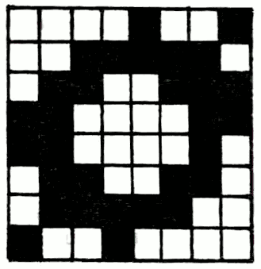

## EL EDITOR DE CARACTERES

Seleccionando la opción Q del menú principal (los usuarios de 48K tendrán que cargar un overlay) tendremos el Editor de Caracteres.

Este submenú te permite cambiar la forma de los caracteres que se muestran en la pantalla. Se pueden tener hasta cinco sets de caracteres diferentes en memoria y en cualquier momento cambiarlos entre ellos usando ESCC 0-5 o una acción CHARSET en Procesos o Respuestas.

Los sets de caracteres están numerados de 0 a 5, set 0 es el set normal y no puede ser cambiado excepto por los caracteres que tengan valores de 0 a 15, que son los diferentes tipos de sombreados, y también los del 144 al 185 que son los GRAFICOS DEFINIDOS por el USUARIO normales del Spectrum.

Si usas en este momento [P] para mirar la tabla, encontrarás solamente estos caracteres presentes. Tendrás que insertar un set en blanco antes de que lo puedas cambiar o cargarlo. Esto se hace para conservar memoria en la base de datos si no estás cambiando sets de caracteres.

De momento, solamente vamos a usar el editor para cambiar una de las formas de sombreado. Estos son solamente caracteres normales con los cuales el sistema gráfico colorea un área de la pantalla.

\[A 0 15 ENTER\] permitirá que edites el carácter 15 del set 0. Como éste es un sombreado poco importante, lo alteraremos para que represente el trabajo de la reja de hierro del Pabellón de Música.

Cada carácter de PAW está definido por un entramado de 8 pixels por 8 pixels. La parte izquierda superior de la pantalla mostrará una versión agrandada del diseño tal y como es en este momento.

En la parte media de arriba y en la derecha te mostrará cómo se ve cuando se use como un sombreado (de ambas formas: la normal y la inversa), mientras que la parte de abajo de la pantalla muestra un sumario de las órdenes a tu disposición y el set de caracteres actualmente editado.

Usa las teclas del cursor (CAPS SHIFT 5 hasta 8 en un 48K) para mover el cursor rojo parpadeante alrededor del entramado, y la tecla de ESPACIO para cambiar la situación de un píxel. Es decir si el píxel está encendido (negro) lo pondrá apagado; y si está apagado (amarillo o blanco) lo encenderá. Inténtalo y verás lo que queremos decir.

El sombreado o el diseño que requerimos es el que muestra el Diagrama 5. Cuando hayas terminado usa [R] para volver a dibujar los dos cuadros donde se muestran los sombreados y verás la nueva forma de entramado. Finalmente pulsa ENTER para terminar la edición.

Diagrama 5

La cara B de la cinta contiene 22 diferentes sets de caracteres, que pueden ser cargados en los sets de caracteres del 1 al 5, después de haberlos insertado, por supuesto. Después de la inserción de un set, la opción de usar ese set como set principal o set por defecto se ofrece en el menú de Colores de Fondo.

