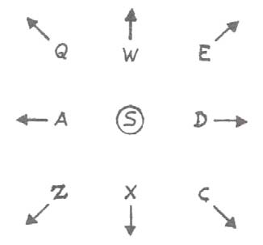
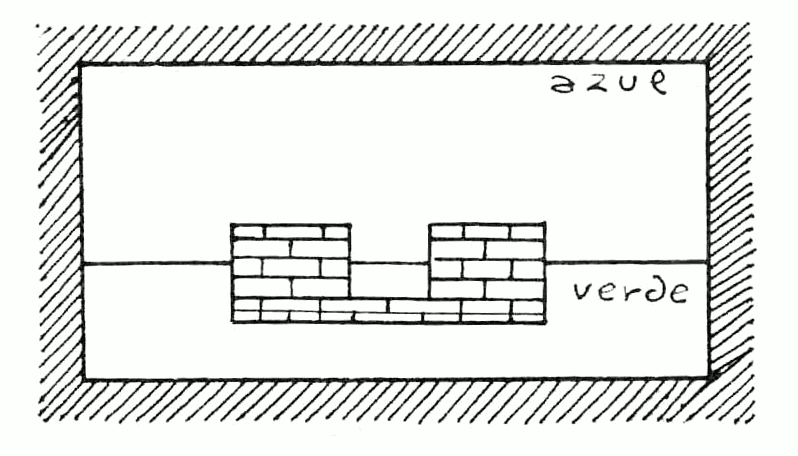
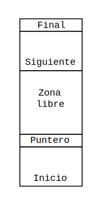

## Editor gráfico

El sistema gráfico que se usa en PAW para dibujar, se llama de «Línea y relleno» que es muy eficiente en el uso de la memoria para el tipo de gráficos que se necesitan en los juegos de aventuras. En vez de guardar una imagen de la pantalla \(«screen»\) como hacen muchos programas comerciales, guarda una lista de los comandos que usaste para dibujarla. De esta forma, incluso las imágenes o los dibujos más complejos consumirán solamente 2 K de memoria en comparación a las 7 K que ocupa una pantalla normal. De hecho, descubrirás que se pueden hacer diseños efectivos incluso con tan solo unos 100 bytes, cuando tengas práctica, por supuesto.

Una lista de comandos guardada, se llama una «cadena de dibujo». Existe una cadena de dibujo para cada localidad que insertes usando la opción de localidad del menú principal. Es decir, PAW te reserva ya un espacio para cada pantalla que hayas creado cuando has hecho el texto. Si la dibuja o no, ya es cosa tuya. Por lo tanto, si solamente dibujas unas cuantas, las otras cadenas de dibujo estarán vacías.

Cada dibujo, \(y por lo tanto cada localidad\) tiene un color definido de papel y de tinta. Seleccionando la opción \[D\] del menú, se te presentará un submenú en el cual puedes arreglar estos valores. Usa \[P\] para ver que ya existe una entrada para las 9 localidades que hemos creado en el juego de demostración. Todas ellas estarán de momento marcadas como subrutinas, lo cual dice a PAW dos cosas:

1. No dibujes este gráfico cuando describas una localidad.
2. Este es un _subimagen_ que se puede usar en otros imágenes.

La facilidad de tener varias subimágenes es muy similar a la idea que usábamos antes con las tablas de subprocesos. Luego veremos un ejemplo de ellos. Como ejemplo de uso de los gráficos, dibujaremos la imagen del pabellón de música como se vería desde la localidad 4 (el camino). Como queremos que PAW dibuje el gráfico cuando visite la localidad, tendremos que asignarle a nuestro gráfico un valor para papel y para tinta. Usaremos un fondo negro (o sea un papel negro) y una tinta amarilla: Teclea \[A 4 0 6 ENTER\]. Si ahora vuelves a usar \[P\] verás que en la entrada para la localidad 4 dirá:

Localidad 4 	Papel: 0	Tinta: 6

Si aún no estás contento y quieres cambiarlo, tendrías que usar la opción de corregir \(por ejemplo: \[A 4\]\). Seleccionemos la opción \[G\] del menú. Los usuarios de 48K se habrán sorprendido al ver que no necesitaban cargar otro _overlay,_ esto es porque caracteres, colores por defecto, y gráficos están todas en el mismo. Si usas la opción «arreglar», limpiará todos los _overlays_ que PAW tenga en memoria y si deseas usar otra opción, excepto cargar/grabar o memoria libre, necesitarás cargar el _overlay_ que las contenga.

Pero continuemos con los gráficos. Para cada dibujo del juego hay varias opciones que permitirán: arreglar, imprimir en pantalla, copiar a una impresora, calcular el tamaño de un dibujo o hacer un volcado \(«dump»\) de la pantalla. Como nosotros vamos a hacer el dibujo de la localidad 4, hemos de teclear \[A 4 ENTER\]. La pantalla se limpiará dejando solo dos líneas de información en la zona inferior. La información proporcionada, de izquierda a derecha es la siguiente:

1. Línea superior:
   * Tinta seleccionada.
   * Papel seleccionado.
   * Estado del parpadeo \(«flash»\)
   * Estado del brillo \(«bright»\)
2. Línea inferior:
   * Coordenadas x, y de la posición de dibujo.
   * Número de localidad editada.

A veces se da otra información adicional que explicaremos en su momento.

Si miras con atención, notarás un solo píxel parpadeante en la parte inferior derecha, es lo que se llama «el punto» y muestra la posición de comienzo para cualquier gráfico. Tecleando \[E\], verás que empieza a aparecer una línea cuya parte inicial estará en «el punto» y cuyo final podrás mover usando las teclas alrededor de la letra S como indica el esquema:



Si quieres hacer uso del _joystick,_ puedes conectarlo al puerto 2 (Plus 2 e Interface 1). Los usuarios de un interface tipo Kempston deben apretar \[SYMBOL SHIFT\] y \[J\] para activarlo. En la línea inferior aparecerá una «J» que indica que está activo y el _joystick_ controlará el final de la línea. El movimiento es píxel a píxel, pero se puede acelerar a ocho píxeles cada vez si se mantiene apretado \[CAPS SHIFT\] al mismo tiempo que las teclas de movimiento o mientras se maneja el _joystick._

La línea que se usa para dibujar es del tipo llamado «elástico», porque se comporta como un elástico tensado mientras se mueve por la pantalla, con ello se consigue una mayor exactitud al posicionarla antes de que se dibuje.

En nuestro juego de ejemplo vamos a usar gráficos a media pantalla, por lo que necesitamos dejar varias líneas libres en la parte inferior para el texto. Con \[SYMBOL SHIFT\] más \[Y\] activamos la retícula para mostrar los límites entre caracteres. Ahora hay que mover la línea a X = 0, Y = 47 y luego mover el «punto» al final de la línea con \[SYMBOL SHIFT\] y \[P\] \(de «plot»\) para que el dibujo comience en ese píxel. Lo siguiente es pasar la línea a X = 255, Y = 47 usando \[A\] solo una vez, lo que de paso sirve para demostrarte que la pantalla no tiene límites en los bordes y que al salir por un lado, entrarás por el otro (esta opción, al parecer insignificante, te ahorrará mucho tiempo en tus dibujos). Ahora pasamos a dibujar la línea, lo que se llama «fijarla». Para ello apretamos \[SHYMBOL SHIFT\] y \[L\] \(de línea\) o usando la opción «fuego» del _joystick._

Si cometes un error, puedes borrar una orden previa con «DELETE» \(\[CAPS SHIFT\] y \[0\] en un 48 K\), lo cual te llevará hasta el inicio del dibujo si así lo deseas.

NOTA: Mientras no se especifique lo contrario, todas las órdenes de inserción en la cadena de dibujo \(como «plot» o «line»\) requieren el uso de SYMBOL SHIFT, por lo cual lo abreviaremos a «SS».

NOTA: Todas las coordenadas se darán en forma X, Y. Por ejemplo: 255, 47 en vez de continuar con el engorroso «X = 255, Y = 47».

Los bordes o marcos alrededor de los gráficos parecen estar de moda, así que vamos a poner uno. Primero hay que mover el final de la línea a 248, 55 y hacer un «plot» en ese punto. Luego vamos a movernos a 248, 168 y fijar la línea, luego a 7, 168 y volvemos a fijar la línea. Lo mismo que en 7, 55 y volvemos a 248, 55. Nos quedará, pues, un cuadrado. Nota que hemos ido por la línea que divide las celdas de caracteres. Esto se hace para minimizar el problema de dos colores por caracter que permite el Spectrum. Es conveniente que leas bien el manual y veas cuál es este problema.

Para hacer el borde mucho más atractivo usaremos la opción «shade». Movemos el final de la línea a 248, 53 y apretamos las teclas \[SS\] + \[S\] para tener un «shade». La parte inferior de la pantalla se cambiará y te preguntará el número de diseño que deseas. De momento tecleemos \[12 ENTER\], y a continuación se te pedirá otro segundo diseño. Este diseño se pondría encima del primero, superpuesto. O sea, que se pueden mezclar dos diseños para formar uno más complicado.

De momento solamente queremos uno, y teclearemos \[12 ENTER\] otra vez. Automáticamente el borde quedará con su relleno. Notarás que el punto no se ha movido y que la línea sale desde el mismo sitio desde donde estaba antes del relleno.

### CARACTERISTICAS DE LA ORDEN SHADE (SOMBREADO):

1. Es un comando muy rápido.
2. Se pueden sombrear incluso áreas con perímetro muy difícil.
3. Se puede colar a través de cualquier píxel que hayas dejado como «agujero» en tu dibujo.
4. El área a sombrear debe estar definida como mínimo por una línea de un solo píxel, o por el borde de la pantalla como en nuestro dibujo.
5. A veces, si quedan sitios sin rellenar, se puede hacer poniendo el punto de comienzo dentro de la zona vacía.
6. Hay 16 diseños que se pueden cambiar usando el editor de caracteres. \(Ver [Editor de caracteres](05-editor-de-caracteres-md)\).
7. Si se cambia un diseño, este se cambiará en todos los dibujos en los que haya sido usado. Por eso recomendamos usar la mayoría para un uso general y definir unos cuantos para usos  muy especiales.
8. Por supuesto, se pueden mezclar diversas combinaciones de diseños.

Ahora, en nuestro dibujo, vamos a ir con el cielo y con la tierra. Ponemos el color del papel moviendo la línea a 8,56 y apretando \[SS\] + \[A\] para un **movimiento absoluto.** Esto no afecta al píxel como lo hacia «plot». Ahora, si tecleamos \[SS\] + \[Y\] quitaremos la retícula, pues mientras esté activa **no** se ven los colores. Para poner la hierba de color verde, apretaremos \[SS\] + \[C\] \(para el papel\), y como el verde es color 4 teclearemos \[4 ENTER\] \(fíjate cómo en la línea inferior de la pantalla el número del papel cambia a 4\). Ahora hay que mover la línea a 246, 87 y apretar \[SS\] + \[B\] \(de «block»\): esto coloreará el rectángulo del cual la línea forma la diagonal con el actual color para el papel y para la tinta.

El azul del cielo: haz \[SS\] + \[A\] o un movimiento absoluto hacia 247, 88. Seleccionemos ahora papel azul con \[SS\] + \[C\] y \[1 ENTER\], movámonos a 8, 167 y hagamos otro «block» con \[SS\] y \[B\]. Veremos como el área cuya diagonal estamos señalando se tiñe del color que hayamos elegido. La base del pabellón: con ladrillos rojos.

Para evitar problemas de mezcla de color, debemos hacerla respetando exactamente la frontera de los dos caracteres es decir de 3 de altura por 16 de ancho. Seleccionemos el papel rojo con \[SS\] + \[C\] y \[2 ENTER\] y la tinta negra con \[SS\] + \[X\] y \[0 ENTER\]. Movemos la línea a 191, 72 y hacemos un «plot» con \[SS\] + \[P\]. Con \[SS\] + \[L\] \(o el botón de fuego del _joystick_\) dibuja lo siguiente:

64,72 64,95 111,95 111,75 144,75 144,95 191,95 191,72

Luego, movemos la línea a 189,73 y hacemos un «shade» usando el diseño 14, por ejemplo: \[SS\] + \[S\], \[14 ENTER 14 ENTER\] y crearemos el efecto de ladrillos. Tu dibujo debe verse ahora como el del diagrama 6.

###### Diagrama 6



**LA ESCALERITA:** Mover la línea a 144,78. Con \[SS\] + \[R\] \(movimiento relativo\): Un movimiento relativo es la que mueve el punto como «plot» y como el movimiento absoluto, pero a un píxel que está a una distancia fijada del punto actual, en vez de hacerlo a una posición absoluta X, Y. Se usa para mantener juntos los grupos de órdenes que dibujan un solo objeto en un gráfico. La razón de esto la veremos en un momento. Fijemos la línea a 112,78. \[SS\] + \[R\] \(movimiento relativo\) para mover a 111,81. Fijemos la línea a 143,81 y continuamos por los siguientes grupos de coordenadas:

Movimiento relativo a 144,84

Línea a 112,84

Movimiento relativo a 111,87

Línea a 143,87

Movimiento relativo a 144,90

Línea a 112,90

Movimiento relativo a 111,93

Línea a 143,93

Ahora vamos a examinar las opciones de edición que podemos usar para corregir errores, aparte del «delete» ya conocido. Como ejemplo, vamos a mover toda la base de ladrillos que acabamos de crear, dos límites de caracteres a la derecha. El borrarla con «delete» toda entera para volverla a pintar, sería un poco paliza.

Vamos a explicar cómo guarda PAW la cadena de dibujo. Mientras tú pintas tu obra maestra, PAW va añadiendo cada orden a la cadena. El sitio donde la añade se llama el «puntero de cadena» y de momento, está al final de la cadena. Es posible para PAW retroceder a través de las órdenes hasta cualquier punto de la cadena. Para ello se usa el cursor de la derecha \[CAPS SHIFT + 8\] una sola vez. No hay que preocuparse si desaparece, puesto que el dibujo todavía está ahí pero aunque el dibujo esté todavía en memoria, PAW solo lo pinta hasta donde esté el puntero, que estará ahora al **comienzo** de la cadena. El [diagrama 7](#diagrama-7) te facilitará la visión de cómo se sitúa la cadena en la memoria. Puedes adelantar al siguiente comando con cursor abajo \[CAPS SHIFT + 6\] y puedes retrasar al anterior comando con cursor arriba \[CAPS SHIFT + 7\]. Esto es lo que se llama «comando previo», no borra la orden, solo mueve el puntero una orden hacia atrás.

###### Diagrama 7



Volviendo con lo nuestro, usa \[CAPS SHIFT + 6\] hasta que lleguemos a la orden «plot», que era, como recordarás, 191,72, con la cual se inició la base del pabellón de música. Usa «delete» para borrarlo de la cadena y entonces haz un «plot» 207,72 que PAW insertará en la cadena de dibujo donde está el puntero. Si usamos «next», o sea \[CAPS SHIFT + 6\], la línea de la base aparecerá dibujada. En vez de usar «next» cada vez para llegar al final de la cadena hay otra forma mucho más fácil: cuando estés al principio de una cadena muy larga si tecleas \[ENTER\] terminará la edición y te llevará al submenú. Entonces teclea \[A 4 ENTER\] para corregir el dibujo otra vez y ya tendrás el puntero al final de la cadena. **Es importante que te des cuenta de que la base entera se mueve como una sola unidad, porque antes usamos un movimiento relativo, cuando la pintamos originalmente.**

### LA BALAUSTRADA

Seleccionemos tinta blanca \[SS\] + \[X\], \[7 ENTER\], y papel transparente (es un color especial que significa no modificar el color), lo hacemos con \[SS\] + \[C\], \[8 ENTER\]. Luego:

`PLOT 206,96   LINEA 206,109   LINEA 162,109   LINEA 162,96`

mueve ahora la línea a 163,97 y haz un «shade» con el diseño 15 \(el que habías diseñado en la sección sobre el editor de caracteres\), se hace con \[SS\] + \[S\], \[15 ENTER 15 ENTER\].

`PLOT 125,96   LINEA 125,109   LINEA 81,109   LINEA 81,96`

mueve la línea ahora a 82,97 y utiliza el diseño de «shade» número 15 otra vez.

Vamos ahora con los palos del pabellón de música:

`PLOT 103,96   LINEA 103,136   LINEA 106,136   LINEA 106,96`

mueve la linea a 104,121 y con \[SS\] y \[F\] accedemos al comando «fill» \(relleno\) que llena un área previamente definida completamente con píxeles configurados en un forma muy similar a «shade».

`MOVIMIENTO RELATIVO 184,96   LINEA 184,136 LINEA 181,136 LINEA 181,96`

mueve la línea a 183,122 y haz otro «fill» con \[SS\] + \[F\].

Veamos ahora el techo del Pabellón:

```
MOVIMIENTO RELATIVO 207,143  LINEA 206,140   LINEA 202,136
LINEA 86,136   LINEA 83,139  LINEA 80,143    LINEA 207,143
```

mueve la línea a 205,141 y haz un «shade» con el diseño 15.

```
MOVIMIENTO RELATIVO 144,166   LINEA 220,139
MOVIMIENTO RELATIVO 65,139    LINEA 144,166
```

mueve la línea a 144,164 y haz un FILL.

### Crear un efecto de volumen en el pabellón de música:

Selecciona «over» \(por encima\) con las teclas \[SS\] + \[O\], aparecerá una letra O en la línea de estado para indicar que el «over» está activado. Normalmente cada «plot» y «línea» lo que hace es _setear_ los píxeles a los que afecta, pero esos mismos comandos, si se insertan mientras la acción «over» está activada, lo que hacen es _setear_ todos los píxeles _reseteados_ y _resetear_ todos los píxeles _seteados._ Es decir, encienden los apagados y apagan los encendidos.

Se parece mucho a la acción que hacía el botón de espacio cuando mirábamos el editor de caracteres. Es importante recalcar que el estado de «over» \(y el inverso que veremos más tarde\) están codificados como parte de la orden. Para obtener el efecto, tienes que insertar la orden mientras esté activo, no puedes cambiar un «plot» o «línea» insertado previamente sin haberlo borrado antes. «Over» se cancela con «start» \[CAPS SHIFT + 8\], «previous» \[CAPS SHIFT + 7\] y «delete». Ahora con el «over» seleccionado haz lo siguiente:

`LINEA 115,140  MOVIMIENTO RELATIVO 144,166   LINEA 171,140`

y después \[SS\] + \[O\] para quitar el «over» otra vez. Debes tener dos líneas dibujadas con píxeles en parte _seteados_ y en parte _reseteados._

El último toque del pabellón:

`MOVIMIENTO RELATIVO 142,136  LINEA 142,96  LINEA, 145,96  LINEA 145,135`

mueve la línea a 143,133 y haz un «fill».

La parte trasera de la balaustrada debe ser un poco más pequeña:

```
MOVIMIENTO RELATIVO 125,107   LINEA 161,107
MOVIMIENTO RELATIVO 162,96    LINEA 126,96
```

mueve la línea a 128,98 y haz un «shade» con el diseño 15. Mueve la línea a 150,98 y haz un «shade» con el diseño 15 otra vez.

Para que quede mejor, deberíamos hacer destacar el palo central quitando una línea de píxeles a cada lado. Hagamos \[SS\] + \[I\] \(«inverse»\) y la letra «I» aparecerá en la línea de estado para indicarte que el «inverse» está activado.

**INVERSE** hace que cualquier «plot» y «línea» _reseteen_ o apaguen los píxeles afectados en vez de _setearlos_ o encenderlos, por lo tanto:

```
MOVIMIENTO RELATIVO 141,95   LINEA 141,107
MOVIMIENTO RELATIVO 146,108  LINEA 146,96
```

ahora quita el «inverse» con \[SS\] + \[I\].

### LA CERCA

Vamos a usar una técnica importante de desdibujar el perímetro de un diseño de sombreado \(«shade»\):

Tinta negra \[SS\] + \[X\], \[0 ENTER\].

```
PLOT 8,104  LINEA 79,104  LINEA 79,88   LINEA 8,88
PLOT 247,88 LINEA 208,88  LINEA 208,104 LINEA 247,104
```

Usemos el diseño «shade» número 7 en 246,102 y 11,102. Vamos a desdibujar la parte de arriba de la cerca para crear algunas pequeñas puntas: \[SS\] + \[I\] \(«inverse»\).

```
PLOT 247,104  LINEA 208,104
PLOT 79,104   LINEA 8,104
```

Luego quita el «inverse».

Para terminar el efecto:

```
PLOT 3,101    LINEA 79,101
PLOT 208,101  LINEA 247,101
```

Vamos a añadir ahora unos matorrales de hierba usando la subrutina que mencionamos anteriormente. Esto nos economizará memoria y tiempo. Con «enter» vamos al submenú. Como la ocalidad 0 es la pantalla del título vamos a usarla en nuestro juego de demostración para que su cadena de dibujo contenga nuestros matorrales de hierba. Usemos \[A 0 ENTER\] para corregir el dibujo de la localidad 0. Nos damos cuenta de que el número está seguido por la letra «S», que indica que es una subrutina \(no se pintará\).

Pinta el hierbajo con un `PLOT 72,72` y ahora pongamos líneas entre los siguientes puntos:

`68,85 77,73 74,89 81,73 79,94 87,72 87,94 92,70 94,86 95,70 99,79 98,69`

Volvamos al comienzo de la cadena con \[CAPS SHIFT + 8\] y usemos el comando «next» \[CAPS SHIFT + 6\] para ir hasta justo después del «plot». Usemos «delte» para quitarlo.

**OJO:** esta acción extraña significa que ahora la primera línea está en 0,0 y nos permite colocar el dibujo con exactitud.

**OJO:** si tratas de corregir el dibujo otra vez \(«amed»\) saldrá el mensaje «Out of range» que significa fuera de límites, porque PAW no puede dibujar _fuera de la pantalla._ El puntero de cadena deberá estar situado exactamente antes de la primera orden «línea». Así que insertamos el «plot» otra vez mientras editas la cadena, borrándolo de nuevo al final.

Corrige el dibujo 4 de nuevo \[A 4 ENTER\] y hagamos un «plot» en el punto 217,69. Ahora con \[SS\] y \[G\] activaremos un bucle «gosub» que te pedirá el número de la localidad que vas a usar, teclea \[0 ENTER\] para usar nuestro hierbajo que hemos definido en esa localidad.

Lo siguiente que se te pedirá, será la escala en que vas a dibujarlo, esta escala va de 8 en 8 \(o sea en octavos\) desde su tamaño original. Por ejemplo, si tecleas \[4 ENTER\] será 4/8 \(4 octavos\) igual a la mitad.

```
PLOT 21,58   GOSUB 0   escala 5
PLOT 60,74   GOSUB 0   escala 3
PLOT 103,61  GOSUB 0   escala 4
```

Y para demostrar errores:

`PLOT 128,170   GOSUB 0   escala 0`

Supongo que sabrás que escala 0 significa tamaño completo \(no cero octavos\). El error que se ha generado ha dejado el puntero de cadena antes del comando que causó el error: en este caso el «gosub».

Parecería que no hay forma de borrar esto sin continuar haciendo «plots» cada vez más lejos. Pero de hecho, \[«graph»\] que es \(\[CAPS SHIFT + 9\] en un 48K\) borrará el siguiente o próximo comando y podrás borrar también el «plot» de esta manera.

Ten en cuenta que, al final de una edición es posible dejarse órdenes por encima del puntero de cadena que sean inútiles. Puedes borrarlas todas usando «delete next» \(«graph»\) por un tiempo. Ahora vuelve al menú principal y selecciona la tabla de respuestas \(los de 48K deberán cargar un _overlay_\). Corrige la entrada \* \* para que ponga `MODE 3 3 LINEA 16` antes de `GOTO 2`. La acción «MODE 3» selecciona uno de los modos de operar la pantalla. En este caso quedará un área de gráfico fijo, ningún texto la mueve; el segundo 3 le informa a PAW de que no debe cambiar el color del borde y que debe imprimir «CONT...» cuando la pantalla esté llena de texto. «LINEA 16» le dice a PAW dónde va a empezar la primera línea de texto. Finalmente usamos «test» para probar la aventura \(de nuevo los de 48K deben cargar un _overlay_\) para verla en acción.

El dibujo solamente se pinta la primera vez que visites la localidad, pero no en visitas siguientes. Esto es lo que se llama el modo normal para gráficos. Es posible de todos modos seleccionar «on» y «off», siendo «on» la opción para siempre poner los gráficos y «off» nunca poner los gráficos.

Se seleccionan con: 
```
PICS NORM
PICS ON
PICS OFF
```
Estas órdenes no se explicaron cuando hablamos de la tabla de respuestas, pero están todas en el manual técnico. \(Que también habrás de leer, je, je\).

Debes decidir si permites al jugador cambiar entre estas opciones o no, y forzarle a usar un solo método desde el comienzo.
	

