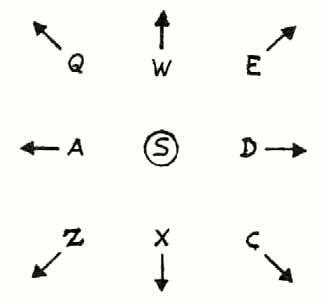

## EL EDITOR GRÁFICO

El sistema usado por PAW para dibujar es el llamado de "Línea y Relleno" que es muy eficiente en el uso de la memoria para el tipo de gráficos que se necesitan en los juegos de aventuras. La forma como actúa es, en vez de guardar la imagen que has pintado en forma de pantalla (screen) como hacen muchos programas comerciales, lo que hace es que guarda una lista de los comandos que usaste para dibujarlo.

De esta forma, incluso las imágenes o los dibujos más complejos consumirán solamente 2K de memoria en comparación a las 7K que lleva una pantalla normal. De hecho, encontrarás que se puede hacer algo incluso con unos 100 bytes, cuando tengas práctica, por supuesto. La lista de comandos que se han guardado es lo que se llama una "cadena de dibujo", y hay una cadena de dibujo para cada localidad que insertes usando la opción de Localidad del menú principal. Es decir, PAW te reserva ya un espacio para cada pantalla que tú has creado cuando has hecho el texto. Si las dibujas o no ya es cosa tuya. Por lo tanto, si solamente dibujas unas cuantas, las otras cadenas de dibujo estarán vacías.

Cada dibujo, (y por lo tanto cada localidad) tiene un color definido de Papel y de Tinta. Seleccionando la opción [D] del menú se te presentará un submenú en el cual puedes arreglar estos valores. Usa [P] para ver que ya existe una entrada para las 9 localidades que hemos creado en el juego de demostración.

Todas ellas estarán de momento marcadas como subrutinas, lo cual dice a PAW dos cosas:

1. No dibujes éste gráfico cuando describas una localidad.
2. Este es un subdibujo que puede ser usado en otros gráficos.

La facilidad de tener varios subdibujos es muy similar a la idea que usábamos antes con las tablas de subprocesos. Luego veremos un ejemplo de ellos.

Cano ejemplo para uso de los gráficos, lo que haremos será dibujar el gráfico del Pabellón de Música como se vería desde la localidad 4 (el camino).

Como queremos que PAW dibuje el gráfico cuando visite la localidad, tendremos que asignarle a nuestro gráfico un valor para Papel y para Tinta.

Usaremos un fondo negro (o sea un papel negro) y una tinta amarilla: Teclea [A 4 0 6 ENTER]. Si ahora vuelves a usar [P] verás que en la entrada para la localidad 4 dirá:

Localidad 4 	Papel: 0	Tinta: 6

Si aún no estás contento y quieres cambiarlo, tendrías que usar la opción de corregir (por ejemplo: A 4).

Seleccionemos la opción G del menú.
Los usuarios de 48K se habrán sorprendido al ver que no necesitaban cargar otro overlay, esto es porque Caracteres, Colores por Defecto, y Gráficos están todas en el mismo.

Si usas la opción Arreglar limpiará todos los overlays que PAW tenga en memoria y si deseas usar otra opción, excepto CARGAR/GRABAR o Memoria Libre, necesitarás cargar el overlay que las contiene.

Pero continuemos con los gráficos.

Para cada dibujo del juego hay varias opciones que permitirán: Arreglar, Imprimir en pantalla, Copiar a una impresora, calcular el tamaño de un dibujo o hacer un Volcado (Dump) de la pantalla. Como nosotros vamos a hacer el dibujo de la localidad 4, hemos de teclear [ A 4 ENTER ]. La pantalla se limpiará dejando sólo dos líneas de información en la zona baja.

La información proporcionada, de izquierda a derecha es la siguiente:

1. Línea superior:
   * Tinta seleccionada.
   * Papel seleccionado.
   * Estado de Parpadeo (flash)
   * Estado de Brillo (bright)
2. Linea inferior:
   * Coordenadas x, y de la posición de dibujo.
   * Número de Localidad editada.

A veces se da otra información adicional y ya la explicaremos en su momento.

Si miras con atención, notarás un solo píxel parpadeante en la parte inferior derecha, es lo que se llama "el punto" y muestra la posición de comienzo para cualquier gráfico.

Tecleando [E], verás que empieza a aparecer una línea cuya parte inicial estará en "el punto" y cuyo final podrás mover usando las teclas alrededor de la letra S como indica el esquema:



Si quieres hacer uso del Joystick, puedes insertarlo en el puerto 2 (Plus 2 e Interface 1). Los usuarios de un interface tipo Kempston deben apretar [SYMBOL SHIFT] y [J] para activarlo. En la línea inferior aparecerá una J que indica que está activo y el Joystick controlará el final de la línea.

El movimiento es píxel a píxel, pero se puede acelerar a ocho píxels cada vez si se mantiene apretado CAPS SHIFT al mismo tiempo que las teclas de movimiento o mientras se maneja el Joystick.

La línea que se usa para dibujar es del tipo llamado "elástico", porque se comporta como un tenso elástico mientras se mueve por la pantalla, con ello se consigue una mayor exactitud al posicionarla para el dibujo.

En nuestro juego de ejemplo vamos a usar gráficos a media pantalla, por lo que necesitamos dejar varias líneas libres en la parte inferior de la pantalla para el texto.

Con [SYMBOL SHIFT] más [Y] activamos la Retícula para mostrar las fronteras entre caracteres. Ahora hay que mover la línea a X = 0, Y = 47 y luego mover el "punto" al final de la línea con [SYMBOL SHIFT] I y [P] (Plot) para que el dibujo comience en ese píxel.

Lo siguiente es pasar la línea a X = 255, Y = 47 usando [A] sólo una vez, lo que de paso sirve para demostrarte que la pantalla no tiene fronteras en los bordes y que al salir por un lado, entrarás por el otro (esta opción, al parecer insignificante, te ahorrará mucho tiempo en tus dibujos).

Ahora pasamos a dibujar la línea, lo que se llama "fijarla". Para ello apretamos [SHYMBOL SHIFT] y [L] (De Línea) o usando la opción "fuego" del Joystick. Si se hace un error, se puede borrar una orden previa con DELETE (CAPS SHIFT y 0 en un 48 K), lo cual te llevará hasta el inicio del dibujo si así lo deseas.

NOTA: Mientras no se especifique lo contrario, todas las órdenes de inserción en la cadena de dibujo (como PLOT o LINE) requieren el uso de SHIMBOL SHIFT, por lo cual lo abreviaremos a SS.

NOTA: Todas las coordenadas se darán en forma X, Y. Por ejemplo: 255, 47 en vez de continuar con el engorroso X = 255, Y = 47.

Los bordes o marcos alrededor de los gráficos están de moda, así que vamos a poner uno. Primero hay que mover el final de la línea a 248, 55 y hacer un PLOT en ese punto.

Luego vamos a movernos a 248, 168 y fijar la línea, luego a 7, 168 y continuamos fijando la línea lo mismo que en 7, 55 y volvemos a 248, 55. Nos quedará, pues, un cuadrado.

Es de notar que hemos ido por la línea que divide las celdas de caracteres. Esto se hace para minimizar el problema de dos colores por carácter que permite el Spectrum. Es conveniente que leas bien el manual y veas cuál es este problema.

Para hacer el borde mucho más atractivo usaremos la opción SHADE. Movemos el final de la línea a 248, 53 y apretamos las teclas [SS] + [S] para tener un SHADE.

La parte inferior de la pantalla se cambiará y te preguntará el número de diseño que deseas. De momento tecleemos [12 ENTER], y a continuación se te pedirá otro segundo diseño.

Este diseño se pondría encima del primero, añadiéndose a éste, o sea, que se pueden mezclar dos diseños para formar uno más complicado.

De momento solamente queremos uno, y teclearemos [12 ENTER] otra vez. Automáticamente el borde quedará con su relleno. Notarás que el punto no se ha movido y que la línea sale desde el mismo sitio desde donde estaba antes del relleno.

### CARACTERISTICAS DE LA ORDEN SHADE (SOMBREADO):

1. Es un comando muy rápido.
2. Se pueden sombrear incluso áreas con perímetro muy difícil.
3. Se puede colar a través de cualquier píxel que hayas dejado como "agujero" en tu dibujo.
4. El área a sombrear debe estar definida como mínimo por una línea de un solo píxel, o por el borde de la pantalla como en nuestro dibujo.
5. A veces, si quedan sitios sin rellenar, se puede hacer poniendo el punto de comienzo dentro de la zona vacía.
6. Hay 16 diseños que se pueden cambiar usando el Editor de Caracteres. (Ver Editor de Caracteres).
7. Si se cambia un diseño, éste se cambiará en todos los dibujos en los que haya sido usado.
   Por eso recomendamos usar la mayoría para un uso general y definir unos cuantos para usos
   muy especiales.
8. Por supuesto, se pueden mezclar diversas combinaciones de diseño.

Ahora vamos, en nuestro dibujo, con el cielo y con la tierra.

Ponemos el color del papel moviendo la línea a 8,56 y apretando [SS] + [A] para una MOVIDA ABSOLUTA. Esta Movida Absoluta no afecta al píxel como lo hacia PLOT.

Ahora, si tecleamos [SS] + [Y] quitaremos la retícula, pues mientras esté activa NO se ven los colores.

Para poner la hierba de color verde, apretaremos [SS] + [C] (para el papel), y como verde es el color 4 teclearemos [4 ENTER] (fíjate cómo en la línea inferior de la pantalla el número del papel cambia a 4).

Ahora hay que mover la línea a 246,87 y apretar [SS] + [B] (de BLOCK): esto coloreará el rectángulo del cual la línea forma la diagonal con el actual color para el papel y para la tinta. El azul del cielo: haz [SS] + [A] o una Movida Absoluta hacia 247,88. Seleccionemos ahora papel azul con [SS] + [C] y [1 ENTER], movámonos a 8,167 y hagamos otro BLOCK con [SS] y [B]. Veremos como el área cuya diagonal estamos señalando se tiñe del color que hayamos elegido. La base del Pabellón: con ladrillos rojos.

Para evitar problemas de mezcla de color, debemos hacerla respetando exactamente la frontera de los dos caracteres es decir de 3 de altura por 16 de ancho. Seleccionemos el papel rojo con [SS] + [C] y [2 ENTER].

Y la tinta negra con [SS] + [X] y [0 ENTER].

Movemos la línea a 191,72 y hacemos un PLOT con [SS] + [P]. Con [SS] + [L] (o el botón de fuego del joystick) dibuja lo siguiente:

64,72 64,95 111,95 111,75 144,75 144,95 191,95 191,72

Luego, movemos la línea a 189,73 y hacemos un SHADE usando el diseño 14, por ejemplo: [SS] + [S], [14 ENTER 14 ENTER] y crearemos el efecto de ladrillos. Tu dibujo debe verse ahora como el del diagrama 6.

###### Diagrama 6


**LA ESCALERITA:** Mover la línea a 144,78.

Con [SS] + [R] (MOVIDA RELATIVA): Una MOVIDA RELATIVA es la que mueve el punto como PLOT y como la MOVIDA ABSOLUTA, pero a un píxel que está a una distancia fijada delpunto actual, en vez de hacerlo a una posición absoluta X, Y. Es usado para mantener juntos los grupos de órdenes que dibujan un solo objeto en un gráfico. La razón de esto la veremos en un momento. Fijemos la línea a 112,78.

[SS] + [R] (MOVIDA RELATIVA) para mover a 111,81. Fijemos la línea a 143,81 y continuamos por los siguientes grupos de coordenadas:

MOVIDA RELATIVA a 144,84		LINEA a 112,84
MOVIDA RELATIVA a 111,87		LINEA a 143,87
MOVIDA RELATIVA a 144,90		LINEA a 112,90
MOVIDA RELATIVA a 111,93		LINEA a 143,93

Ahora vamos a examinar las facilidades de edición que podemos usar para corregir errores, aparte del DELETE ya conocido. Como ejemplo, vamos a mover toda la base de ladrillos que acabamos de crear, dos fronteras de caracteres a la derecha. El borrarla con DELETE toda entera para volverla a pintar, sería un poco palizas.

Vamos a explicar cómo guarda PAW la cadena de dibujo. Mientras tú pintas tu obra maestra, PAW va añadiendo cada orden a la cadena. El sitio donde la añade se llama el "puntero de cadena" y de momento el puntero de cadena es el final de la cadena.

Es posible para PAW retroceder a través de las órdenes hasta cualquier punto de la cadena. Para ello se usa el cursor de la derecha (CAPS SHIFT + 8) una sola vez, no hay que preocuparse si desaparece, puesto que el dibujo todavía está ahí. Pero aunque el dibujo está todavía en memoria, PAW sólo lo pinta hasta donde este el puntero, el cual estará ahora al comienzo de la cadena. El diagrama 7 te facilitará la visión de cómo se sitúa la cadena en la memoria.

Puedes adelantar al siguiente comando con cursor abajo (CAPS SHIFT + 6) y puedes retrasar al anterior comando con cursor arriba (CAPS SHIFT + 7). Esto es lo que se llama "Comando Previo", no borra la orden, sólo mueve el puntero una orden hacia atrás.

###### Diagrama 7


Volviendo con lo nuestro, entonces desde el inicio, CAPS SHIFT + 6 hasta que lleguemos a la I como recordarás, 191,72, con la cual se inició la base del Pabellón de Música. orden PLOT, que era, Usa DELETE para borrarlo de la cadena y entonces haz un PLOT 207,72 que PAW insertará en la cadena de dibujo como si fuera el puntero. Si usamos NEXT, o sea (CAPS SHIFT + 6), la línea de la base aparecerá dibujada.

En vez de usar NEXT cada vez para llegar al final de la cadena hay otra forma mucho más fácil: cuando estés al principio de una cadena muy larga si tecleas ENTER terminará la edición y te llevará al submenú. Entonces teclea [A 4 ENTER] para corregir el dibujo otra vez, y ya tendrás el puntero al final de la cadena.

**Es importante que te des cuenta de que la base entera se mueve como una sola unidad, porque antes usamos una MOVIDA RELATIVA, cuando la pintamos originalmente.**

### LA BALAUSTRADA

Seleccionemos tinta blanca [SS] + [X][7 ENTER], y papel transparente (es un color especial que
significa no modificar el color), lo hacemos con [SS] + [C], [8 ENTER]. Luego:

`PLOT 206,96 LINEA. 206,109 LINEA 162,109 LINEA 162,96`

mueve ahora la línea a 163,97 y haz un SHADE con el diseño 15 (el que habías diseñado en la sección sobre el Editor de Caracteres), se hace con [SS] + [S], [15 ENTER 15 ENTER].

`PLOT 125,96 LINEA 125,109 LINEA 81,109 LINEA 81,96`

mueve la línea ahora a 82,97 y utiliza el diseño de SHADE número 15 otra vez.
Vamos ahora con los palos del Pabellón de Música:

`PLOT 103,96 LINEA 103,136 LINEA 106,136 LINEA 106,96`

mueve la linea a 104,121 y con [SS] y [F] accedemos al comando FILL: éste llena un área previamente definida completamente con pixels seteados en un forma muy similar a SHADE.

`MOVIDA RELATIVA 184,96 LINEA 184,136 LINEA 181,136 LINEA 181,96`

mueve la línea a 183,122 y haz otro FILL con [SS] + [F].
Veamos ahora el techo del Pabellón:

```
MOVIDA RELATIVA 207,143 LINEA 206,140 LINEA 202,136 LINEA 86,136
LINEA 83,139 LINEA 80,143 LINEA 207,143
```


mueve la línea a 205,141 y haz un SHADE con el diseño 15.

```
MOVIDA RELATIVA 144,166 LINEA 220,139
MOVIDA RELATIVA 65,139 LINEA 144,166
```

mueve la línea a 144,164 y haz un FILL.

### CREANDO UN EFECTO DE VOLUMEN EN EL PABELLON DE MUSICA:

Selecciona OVER con las teclas [SS] + [O], aparecerá una letra O en la línea de estado para indicar que el OVER está activado.

Normalmente cada PLOT y LINEA lo que hace es setear los píxeles a los cuales afecta, pero esos mismos comandos si se insertan mientras la acción OVER está activada, lo que hacen es setear todos los píxeles reseteados y resetear todos los píxeles seteados. Es decir, encienden los apagados y apagan los encendidos.

Se parece mucho a la acción que hacía SPACE cuando mirábamos el Editor de Caracteres. Es importante recalcar que el estado de OVER (y el Inverso que veremos más tarde) están codificados como parte de la orden; para obtener el efecto, tienes que insertar la orden mientras esté activo, no puedes cambiar un PLOT o LINEA insertado previamente sin haberlo borrado con anterioridad. OVER se cancela con START (CAPS SHIFT + 8), PREVIUS (CAPS SHIFT + 7) y DELETE. Ahora con el OVER seleccionado haz lo siguiente:

`LINEA 115,140 MOVIDA RELATIVA 144,166 LINEA 171,140`

y después [SS] + [O] para quitar el OVER otra vez. Debes tener dos líneas dibujadas con píxeles en parte seteados y en parte reseteados.

El último toque del Pabellón:

`MOVIDA RELATIVA 142,136 LINEA 142,96 LINEA, 145,96 LINEA 145,135`

mueve la línea a 143,133 y haz un FILL.

La parte trasera de la balaustrada debe ser un poco más pequeña:

```
MOVIDA RELATIVA 125,107 LINEA 161,107
MOVIDA RELATIVA 162,96 LINEA 126,96
```

mueve la línea a 128,98 y haz un SHADE con el diseño 15. Mueve la línea a 150,98 y haz un SHADE con el diseño 15 otra vez.

Para que quede mejor, deberíamos hacer destacar el palo central removiendo una línea de píxeles a cada lado. Hagamos [SS] + [I] (DIVERSE) y la letra I aparecerá en la línea de estado para indicarte que el INVERSE está activado.

INVERSE hace que cualquier PLOT y LINEA reseteen o apaguen los píxeles afectados en vez de setearlos o encenderlos, por lo tanto:

```
MOVIDA RELATIVA 141,95 LINEA 141,107
MOVIDA RELATIVA 146,108 LINEA 146,96
```

ahora quita el INVERSE con [SS] + [I].

### LA CERCA

Vamos a usar una técnica importante de desdibujar el perímetro de un diseño de sombreado (SHADE):

```
Tinta negra [SS] + [X], [0 ENTER].

PLOT 8,104 LINEA 79,104 LINEA 79,88 LINEA 8,88
PLOT 247,88 LINEA 208,88 LINEA 208,104 LINEA 247,104
```

Usemos el diseño de SHADE número 7 en 246,102 y 11,102.

Vamos a desdibujar la parte de arriba de la cerca para crear algunas pequeñas puntas: [SS] + [I] (INVERSE).

```
PLOT 247,104 LINEA 208,104		PLOT 79,104 LINEA 8,104
```

Luego quita el INVERSE.

Para terminar el efecto:

```
PLOT 3,101 LINEA 79,101		PLOT 208,101 LINEA 247,101
```

Vamos a añadir ahora unos matorrales de hierba usando la subrutina que mencionamos anteriormente. Esto nos economizará memoria y tiempo. Con ENTER vamos al submenú. Como la ocalidad 0 es la pantalla del título vamos a usarla en nuestro juego de demostración para que su cadena de dibujo contenga nuestros matorrales de hierba. Usemos [A 0 ENTER] para corregir el dibujo de la localidad 0. Nos damos cuenta de que el número está seguido por la letra S, que indica que es una subrutina (no se pintará).

Pinta el hierbajo con un PLOT 72,72 y ahora pongamos líneas entre los siguientes puntos:

`68,85 77,73 74,89 81,73 79,94 87,72 87,94 92,70 94,86 95,70 99,79 98,69`

Volvamos al comienzo de la cadena con (CAPS SHIFT + 8) y usemos el comando NEXT (CAPS SHIFT + 6) para ir hasta justo después del PLOT. Usemos DELETE para quitarlo.

**OJO:** esta acción extraña significa que ahora la primera línea está en 0,0 y nos permite colocar el dibujo con exactitud.

**OJO:** si tratas de corregir el dibujo otra vez (AMEND) saldrá el mensaje " Out of range" que significa fuera de limites, porque PAW no puede dibujar "fuera de la pantalla". El puntero de cadena deberá estar situado exactamente antes de la primera orden LINEA. Así que insertamos el PLOT otra vez mientras editas la cadena, borrándolo de nuevo al final.

Corrige el dibujo 4 de nuevo [A 4 ENTER] y hagamos un PLOT en el punto 217,69. Ahora con [SS] y [G] activaremos un bucle GOSUB y te pedirá el número de la localidad que vas a usar, teclea [0 ENTER] para usar nuestro hierbajo que hemos definido en esa localidad.

Lo siguiente que se te pedirá, será la escala en que vas a dibujarlo, esta escala va de 8 en 8 (o sea en octavos) desde su tamaño original. Por ejemplo, si tecleas [4 ENTER] será 4/8 (4 octavos) igual a la mitad.

```
PLOT 21,58	GOSUB 0	escala 5
PLOT 60,74	GOSUB 0	escala 3
PLOT 103,61	GOSUB 0	escala 4
```

Y para demostrar errores:

`PLOT 128,170	GOSUB 0	escala 0`

Supongo que sabrás que escala 0 significa tamaño completo (no 0 octavos). El error que se ha generado ha dejado el puntero de cadena antes del comando que causó el error: en este caso el GOSUB.

Parecería que no hay forma de borrar esto sin continuar haciendo PLOTS cada vez más lejos. Pero de hecho, [GRAPH] que es (CAPS SHIFT + 9 en un 48K) borrará el siguiente o próximo comando y podrás borrar también el PLOT de esta manera.

A tener en cuenta que, al final de una edición es posible dejarse órdenes por encima del puntero de cadena que sean inútiles. Puedes borrarlas todas usando DELETE NEXT (GRAPH) por un tiempo. Ahora vuelve al menú principal y selecciona la tabla de Respuestas (los de 48K deberán cargar un OVERLAY). Corrige la entrada * * para que ponga MODE 3 3 LINEA 16 antes de GOTO 2. La acción MODE 3 selecciona uno de los modos de operar la pantalla. En este caso quedará un área de gráfico fijo, ningún texto la mueve; el segundo 3 le informa a PAW de que no debe cambiar el color del borde y que debe imprimir "CONT..." cuando la pantalla esté llena de texto. LINEA 16 le dice a PAW dónde va a empezar la primera línea de texto. Finalmente usamos TEST para probar la aventura (de nuevo los de 48K deben cargar un OVERLAY) para verla en acción.

El dibujo solamente será pintado la primera vez que visites la localidad, pero no en visitas siguientes. Esto es lo que se llama el modo normal para gráficos. Es posible de todos modos seleccionar ON y OFF, siendo ON la opción para siempre poner los gráficos y OFF nunca poner los gráficos.

Se seleccionan con: 
```
	PICS NORM
	PICS ON
	PICS OFF
```
Esas órdenes no fueron explicadas cuando hablamos de la tabla de Respuestas, pero están todas en el manual técnico. (Que también habrás de leer, je, je).

Debes decidir si permites al jugador cambiar entre estas opciones o no, y forzarle a usar un solo método desde el comienzo.

